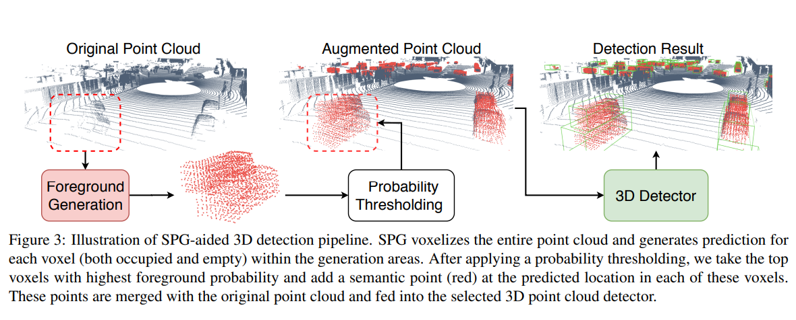
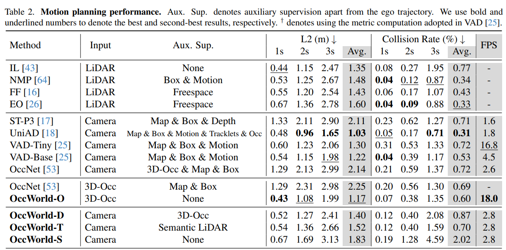

## 3D-RCNN: Instance-level 3D Object Reconstruction via Render-and-Compare

[[Paper]](https://openaccess.thecvf.com/content_cvpr_2018/papers/Kundu_3D-RCNN_Instance-Level_3D_CVPR_2018_paper.pdf)

<p align="center">

</p>


## SPG: Unsupervised Domain Adaptation for 3D Object Detection via Semantic Point Generation

[ArXiv](https://arxiv.org/pdf/2108.06709.pdf)

<p align="center">

</p>

* Domain shift in LiDAR causes severe performance degredation for 3D object detection on out of domain data

* Authors identify shift in LiDAR sparsity as the main culprit, which is particularly caused by weather/environment shift i.e. rain drops causing many missing LiDAR points. Authors refer to this phenomenon as the "missing point" problem.

* Proposed Semantic Point Generation reduces this domain gap by predicting/identifying foreground voxels and generating points to recover the regions.

* The SPG pipeline:
    1. First predicts foreground voxels with binary probability
    2. For each predicted foreground voxel, a semantic point (x,y,z & other properties such as intensity and elongation) is generated
    3. Top K most likely semantic points are augmented to the original point cloud for the final 3D detection. (The general idea is that the augmented point cloud should now have the input in a canonical domain with minimized domain shift)
    4. To code original and semantic points while supporting probability, the detector is also given as input probability for each point, 1.0 for all original points and predicted confidence $p_{f}$ for each semantic point.

* Supervision:
    1. Labels for $p_{f}$ i.e. foreground estimation is generated from 3D bounding box labels. Any voxels within a positive detection label is labeled as foreground with every other voxels as background (negative).
    2. Regression targets for the semantic points are the average xyz+f values calculated per voxel 

* The above label generation process cannot handle empty voxels in the foreground bounding box that do not have any points. In order to provide supervision for such voxels two additional steps are proposed:

    1. "Hide and Predict": synthetically generate occlusion scenarios in the source data (that has better sparsity than target domain) to emulate the missing points problem. Certain % of voxels are randomly masked as voxels the network needs to predict as foreground with the semantic points
    2. "Semantic Area Expansion": Empty foreground voxels are only assigned the ground probabilty $\alpha \in[0,1]$ i.e. set the as positive labels with label smoothing, *but no supervision is done on the point features i.e. xyz, intensity, etc.*

* It's to be noted that "Hide and Predict" on its own is less annotation-intensive (this can techincally be done without bounding box labels), but "semantic area expansion" does massively increase the set of positive labels, for instance up to 510% in the authors' experiments. 


## LiDARMultiNet

* Multi-task loss with positive transfer
* tasks involved: detection, semantic, instance segmentation
* 


## VoxFormer: Using Attention for camera-based 3D semantic mapping

[[Paper]](https://openaccess.thecvf.com/content/CVPR2023/papers/Li_VoxFormer_Sparse_Voxel_Transformer_for_Camera-Based_3D_Semantic_Scene_Completion_CVPR_2023_paper.pdf) [[Code]](https://github.com/NVlabs/VoxFormer)

* Camera based 3D Semantic Occupancy Grid Prediction Network
* 3 key steps in network architecture for end-to-end semantic scene completion:
    1. Image features extracted with a 2D Image Encoder
    2. features lifted to 3D via a lifting method only on non-occlued, valid space to form *Query Proposals*
    3. Full 3D voxel created by padding query proposals with mask token then processed through self-attention for final 3D Semantic Voxels.
* Key assumption is that input images are used to only infer the visible scene structures, and other parts of the scene are later inferred.
* Due to this decoupling, training VoxFormer needs less than 16GB of GPU memory

<p align="center">

</p>

### Bit more detail on the architecture of VoxFormer:
* Main prior work MonoScene predics dense depth an projects pixels to 3D pixels, inevitably projecting 2D features to non-visible voxels as well, hence generating a very blurry feature map of the environment
* VoxFormer specifically focuses on sparse 2D-to-3D projection.
* The method assumes that once reconstructed moreless accurately to develop sparse mapping of the environment, the rest can be hallcuinated.
* VoxFormer approaches 3D projection by considerin forward-projection (depth estimation) based approach
* The class-agnostic query proposal first estimates dense pixel-wise depth to estimate 3D occupancy (hence, the notion of estimationg visible space before hallucination strongly depends on this module, and consequently how well the rest of hte scene is hallucinated also depends on this but also the semantic module that follows). The moule does use off-the shel methods such as stereo or monocular depth estimation, but improves on the poor estimatino by correcting it with 2D Unet-based binary voxel grid prediction network that processes the depth projected to 3D space to generate the binary occupancy grid.
* The voxel queries Q is a learnable query embedding specified per xyz voxel. For efficiency, only those estimate to be occupied by the binary occupancy grid is further processed for semantic classification
* Only the occupied voxel queries with image feature K,V are processed through deformable cross attention to get the updated queries. This is performed per camera by projecting each voxel's 3D position in the image and its offsets used to get hte deformable set of neighbor for feature attention.
* A deformable sefl attention is applied by padding rest of the grid with learnable mask token and hence acquiring refined feature map at lower resolution. (Done at lower resolutino for efficiency and capturing good enough receptive field)
* Output of attention is upsampled to get desired resolution, and FC applied to classify sematics for full scene as shown in the figure.

* Since labeled groun truth is the 3D semantic grid, the semantic grid at full resolution is applied to loss calculation at the output level, while the downsampled and binarize version (class-agnostic) is used to provided loss for stage 1 with its binary occupancy output.
* Model achieved new SOTA for KITTI semantic scene completion.

## OccFormer

## Simple-BEV: What Really Mattesr for Multi-Sensor BEV Perception?
*In stark contrast to all other methods that perform various lifting techniques for 

* Shows that lifting method as simple as xx shows competitive performance to other lifting methods, and instead greater details lie on hyperparameter tuning
* Authors found that resolution of input camera images and batch size has non-trivial impact on the final performance of the BEV perception network.

[[Project Page]](https://simple-bev.github.io/)

## Tri-Perspective View for Vision-Based 3D Semantic Occupancy Prediction

[[Code]](https://github.com/wzzheng/TPVFormer) [[Paper]](https://arxiv.org/pdf/2302.07817.pdf)


## (SSCNet) Semantic Scene Completion from a Single Depth Image

[[Code]](https://github.com/shurans/sscnet) [[Paper]](https://arxiv.org/pdf/1611.08974.pdf)

* Uses Depth image (hence either multi-sensor or stereo/multi-view based)
* Dilated Convolutions used to increase effective receptive field
* flipped Truncated Signed Distance Function used to encode input  depth cloud
* 

## SelfOcc: Self-Supervised Vision-Based 3D Occupancy Prediction

<p align="center">

</p>

* Alleviates need for 3D semantic occupancy labeling (which on its own could be made more efficient by using 3D LiDAR annoation for detection/segmentation but stil fundamentally bottlenecked) by using NeRF-like self supervision based on multi-frame video.

* SelfOcc uses 3D scene reconstruction as its main method of learning:
```
1. For each camera view, differentiable volume rendering from output by the SelfOcc network is use to generate some render given view point. The rener can be of RGB pixels, SDF values (i.e. depth and occupancy), or semantics.
2. Temporal frames, SDF regularization, MVS embedding all serve as additional losses to stabilize deptth estimation and 3D reconstruction for SelfOcc, and prevents overfitting.
3. Predicted SDF can be thresholed to get occupancy estimate, while the optional semantics rendering can be used to provided semantic labels as well.
```

<p align="center">

</p>

* Still has large gap for improvement from using conventional LiDAR or 3D supervision


## S4C: Self-Supervise Semantic Scene Completion with Neural Fields

[[Paper]](https://arxiv.org/abs/2310.07522)

<p align="center">

</p>

* S4C trains semantic occupancy prediction network with monocular input via "self supervision" by utilizing the NeRF objective
* Model first outputs dense feature map that gets fed to NeRF MLP for 3D scene reconstruction. Hence, the modeo <i> does not explicitly outputs a volumetric semantic grid. </i>
* When querying a 3D point, the point is projected to feature map with bilinear interpolation to get the corresponding feature map, which is then fed with positional encoding to density and semantics MLP for prediction
* S4C follows prior work and does not predict color, which apparently improves generalization. Instead, it uses image-based rendering, where color samples from input image generated by 3D point to pixel projection and bilinear interpolation are combine with the occupancy estimation. (The occupancy estimate does from the NeRF).
* For supervision, rendered semantics for viewpoints from futuer timesteps are compared with the actual semantics generated from camera input at that timestep, hence novel view synthesis/reconstuction learning allows the model to infer the whole scene from single monocular input.
* For efficiency, during training only patches of the images are rendered and back-propgated.
* In order to be as generic as possible, S4C uses separetely pre-trained 2D segmentation model to generate 2D semantics supervision
* Potential issue: actually acquriing the 3D occupancy grid for downstream task e.g. navigation & planning then requires full render or partial render of the scene, unless somehow features can be passed implicitly, which will be a major compute/runtime bottleneck.

<p align="center">

</p>

* Evaluation on SSCBench-KITTI-360.
* S4C thus allows for self-supervised 3D SSC training with competitive performance and only camera input/supervision, but is still far behind LiDAR input based, or LiDAR/3D occ supervised methods.

## OccWorld: Learning a 3D Occupancy World Model for Autonomous Driving

[[Paper]](https://arxiv.org/abs/2311.16038) [[Code]](https://github.com/wzzheng/OccWorld)

* World Modeling with 3D semantic occupancy grid representation

<p align="center">

</p>

* Given history and current frame as input, model forecasts a set of future 3D occ grid states and ego motion trajectory separately.
* Hence, the overall framework is a "GPT" style autogregressive generative world model that predicts future scene y{T+1} and ego position p^{T+1}
* For efficiency, the 3D sem occ grid representaiton (generated by whatever perception method from sensor input) is tokenize in self-supervised fashion with vector-quantized variational autoencoder. VQ-VAE
* The compressed tokens are processed by a UNet-like transformer, which at each level compresses/decompresses the set of tokens to smaller/larger set of tokens. Each token at each scale is processed by temporal attention separately to predict token for the next timestep.
* The predicted world tokens are decoed by the same decoder of VQ-VAE to predict forecasted future scene tokens and ego token.
* The spatial encoder-decoder and forecasting components of the model are trained sequentailly in a two-stage training framework.

<p align="center">

</p>

* OccWorld is successfully used in Motion Planning setting by using it as forecasting model to use predicted ego-trajectory as final motion planning output, albeit showing some gap to the performance of state-of-the-art models (which does use much more supervision than OccWorld such as map, bounding box, motion, tracklets, and occupancy for UniAD)

## P3Former: Position-Guided Point Cloud Panoptic Segmentation Transformer

[[ArXiv]](https://arxiv.org/pdf/2303.13509.pdf)

<p align="center">

</p>

Main motivation/intuition:
* Apply the DETR (DEtection TRansformer) paradigm to 3D LiDAR.
* Naive application is mainly limited in instance segmentation performance, caused by 1) geometric ambiguity, where group of similar objects are much harder to separate by instances than in Images and by 2) small objects, where many of them get missed since they very small number of hits in the sparse LiDAR.
* Authors hence propose modules to alleviate aforementioned issues by leveraging position information, which is unique to 3D data such as LiDAR.

### The baseline: making DETR for LiDAR
It has two modules: backbone and segmentation head
* Backbone extracts features from voxelized point cloud. Authors use Cylinder3D, but any architecure would technically work
* Segmentation Head outputs panoptic segmentation masks (one object mask and its category) per learnable query
* Task-specific adaptations are made with query updating, where transformer takes in voxel features, set of queries, set of corresponding mask predictions, to output updated queries i.e. query-specific layers help improve contextualization and therefore final prediction

### MPE: Mixed Parametrized Positional Embedding

* It's challening for NNs to distinguish geometrically similar objects in 3D, especially when they lack textual information in comparison to 2D.
* Main indicator of difference is position
* To maximize utility of this information, MPE fuses 1) Positional Embedding in cartesian space xyz 2) Polar Embeddings in Polar space to provide distributional prior that matches LiDAR pattern

### Position-Aware Segmentation
* MPE sufficient for adding spatial prior/information, but not enough to detect small objects
* PA-Seg predicts mask from both voxel features for its high-semantics features and MPE for position-specific predictions
* voxel-feature based mask and MPE based mask predictions are separately used to calculate the loss, hence applying varying signals to each stream 

### Masked Focal Attention
* Predicted mask from PA-Seg is utilized for improved query-feature interaction
* Predicted masks are used after PA-Seg to run masked attention on features for further feature & query refinement

### Conclusion

The LiDAR-based P3Former, with all its modules, achieves SOTA on SemanticKITTI and nuScenes LiDAR Segmentation over several prior work.
