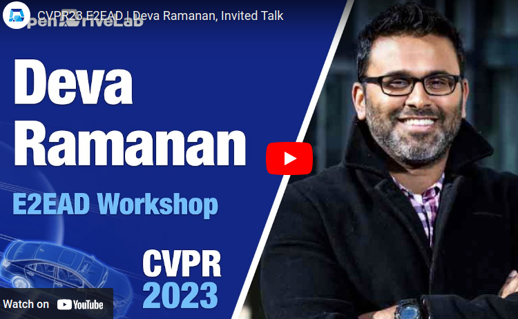
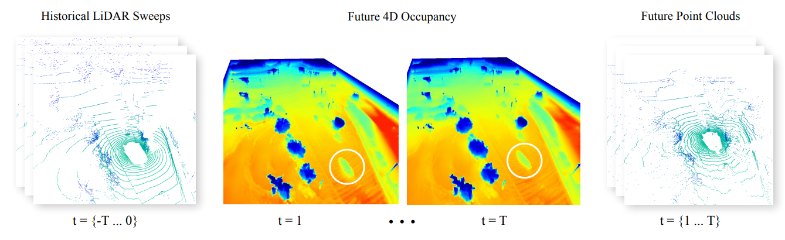

# 3D/4D World modelling and NeRF-like scene reconstruction

Professor Deva Ramanan spoke in CVPR 2023 End-2-End Autonomous Driving Workshop (E2EAD) about the work done at his lab. The lab focuses on building flexible multimodal map representation for world modelling, which has been growing in relevance in RL, IL in general beyond Autonomous Driving. Here I highlight some works either mentioned in the video or other related works. 

## Point Cloud Forecasting as a Proxy for 4D Occupancy Forecasting

### Space Time (4D) Occupancy
* Occupancy state {free, occupied} of particular xyz location at given time t.

<!-- ## Distilling NeRF to a forward network for real-time rendering -->