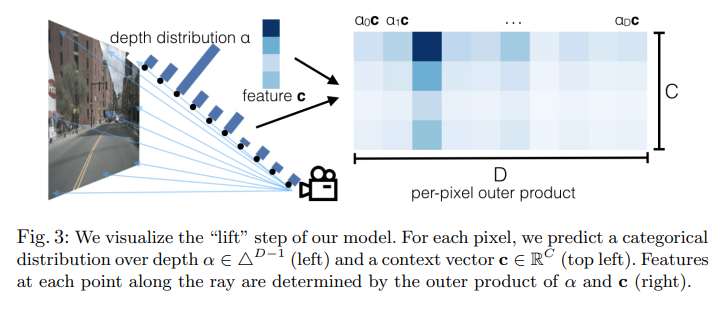
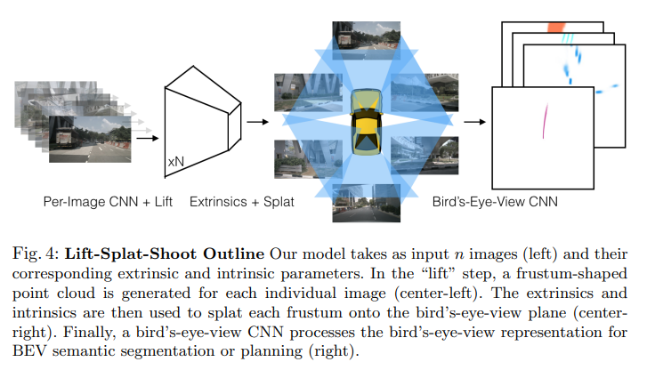
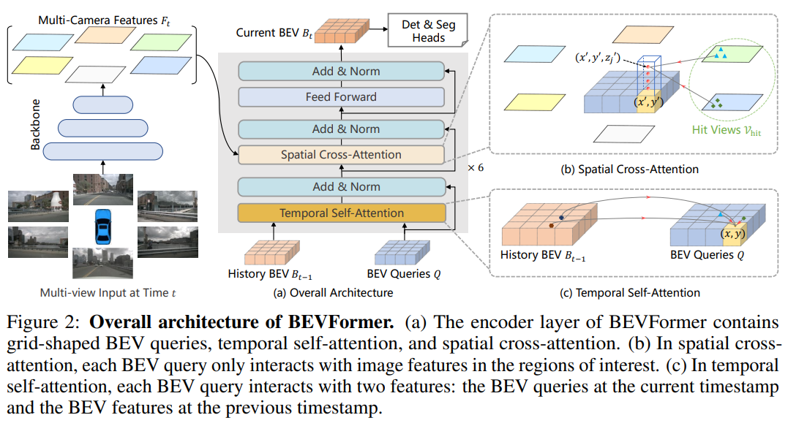
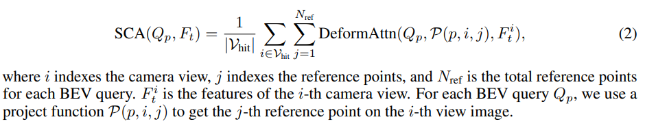
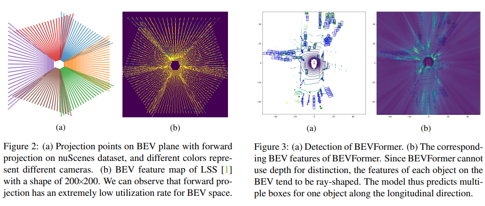
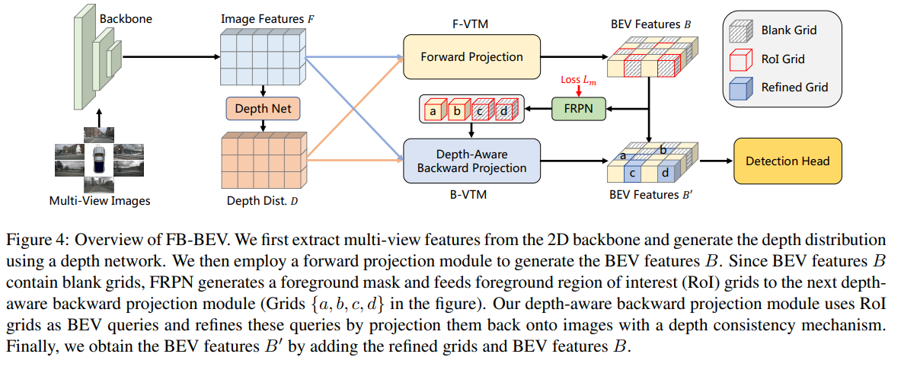
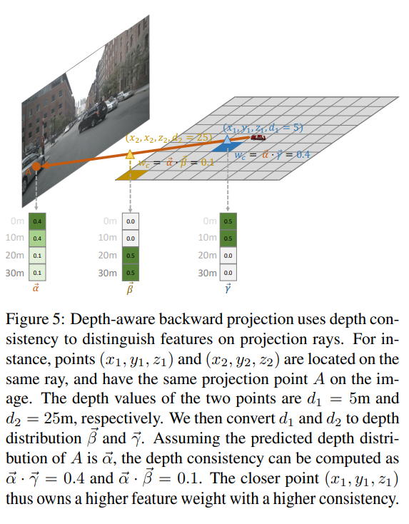
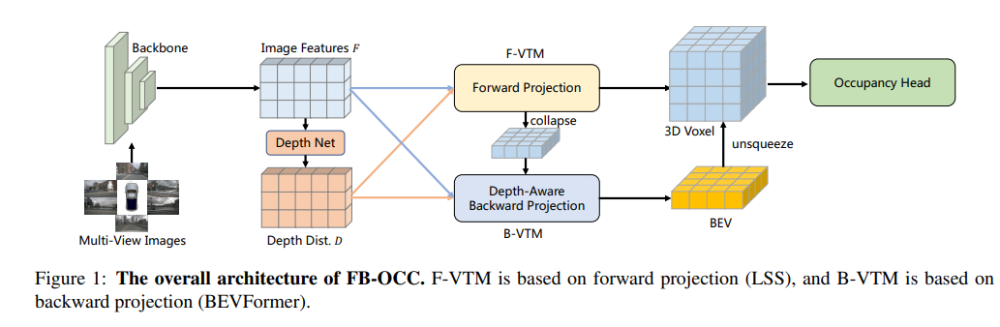

BEV-based autonomous perception and Planning

# Scalable Camera Based 3D Perception

## Lift, Splat, Shoot

<p align="center">

</p>

* LSS estimates a per-pixel depth distirbution and uses the distriubtion to accordingly propagate the latent image features along the camera pixel ray

<p align="center">

</p>

* Features extracted per-image with EfficientNet-B0 is then projected per pixel ray with the discrete depth distribution estimation by the 2D network to generate set of 3D voxel features

* Pillar features are calculated by the frustum pooling module where all features, scaled by the depth distribution, that belong to corresponding (x,y) cell are summed for the final BEV feature map. The summation operation is chosen in particular because there exists derivation of analytic gradient in the case of this cumulative sum operation in comparison to max pooling

* The predicted semantic map is then used to demonstrate the application for autonomous driving by projecting the semantic map to cost for motion planning analogous to Interpretable Neural Motion Planner.

* A rather significant limitation in this process is that the voxel grid of features generated from categorical depth distribution is very large and therefore is a computational bottle neck, while also the forward-projection based method makes it restricted to predicting at defined resolution and restricted FOV defined by the camera frustums, making it less flexible compared to the backward-projection method.

## BEVFormer: Learning Bird's-Eye-View Representation from Multi-Camera Images via Spatiotemporal Transformers

[[Arxiv]](https://arxiv.org/pdf/2203.17270.pdf)

* First few works to propose transformer-based backward projection approach for camera based 3D perception

<p align="center">

</p>

* Uses the Bird's Eye View (BEV) representation as unified representation to support an arbitarry number of camera and tasks (detetion, map segmentation)

* As shown in Figure 2, BEVFormer first processes input images with feature extractor backbone
* processed features are projected to BEV via transformer encoder made up of 6 layers, with the exception that first layer handles spatiotemporal feature fusion while the rest 5 layers in standard self-attention. The learnable BEV queries is W x H x C while it is also fed to layes with positional encoding
* In the first block, temporal attention processes BEV Queries and  history BEV features to aggregate information over time
* the spatial cross-attention fuses multi-camear features by attending to camera features with the BEV queries Q as query input.
* the processed BEV features are self-attended for the rest of the network
* Each of the spatial cross-attention and temporal self attention uses DETR style deformable attention for efficiency, where only selective set of deformable points are selected to run fixed context attention

* Spatial Cross attention in pargicular projects for each (x,y) cell in BEV a dicete "pillar" of points considering various possible depths, projects them to each camera image and for those valid aggregate the information via attention:

<p align="center">

</p>

* As shwon above, for each reference camera the set of valid projected points across z (height) are used to acquire image features then aggregated via attention. Each reference camera view contributes equally.

* SOTA results on BEV semantic map segmentaion and 3D object detecion at the time of pubishing, beating FIERY, LSS, DETR3D.

https://towardsdatascience.com/understanding-perception-and-motion-planning-for-autonomous-driving-2021-e9241e067db7 provides a nice summary of 3 SOTA works from the 2021 CVPR WAD workshop, namely:
1. FIERY
2. PACKNet
3. 3D: Perceive, Predict Plan

FIERY:
1. BEV segmentation from multiview monocular images based on Lift-Splat-Shoot
2. Future instance segmentation prediction
3. Multi-task supervised learning: semantic segmentation, instance segmentation, flow prediction, object center offset prediction.

PACKNet:
1. self-supervised perception for scalabiblity of leraning
2. self-supervised depth estimation: achieved by learning structure from motion: monocular depth estimation and ego motion estimation
3. Space2Depth and Depth2Space blocks: the processed image features are processed to 3D with an invertible process, and processed with 3D convolutions.
4. Mixture of losses: appearence matching loss (SfM) + local smoothness loss

Extending depth estimation to 360 view: Full Surround Monodepth from Multiple Cameras, Vitor Guizilini et al.
1. multi-view camera using 6 cameras
2. extended appearence matching by matching temporally varying views between cameras for improved overlap e.g. match frame of camera A with frame of camera B at a different point in time.

It is a remaining question whether how the reconstructed 3D scene is to be used for planning. Either way, the reconstructed scene could be then used to capture intermediate outputs such as detecting objects, scene segmentation, etc which all require some form of supervised leraning. Or maybe one could infer planning trajectories directly from the reconstructed scenes?


Using HD Maps: The Uber ATG(now merged to Aurora) and Waabi approach

Perceive, Predict, Plan:
1. Predict semantic occupancy grid from perception
a. encompasses multi-class existence e.g. driver and the vehicle can both be predicted
2. Recurrent block used to forecast future instance occupancy from current semantic occupancy grid (which also encompasses past information)
a. predicts two branches: near future and long future.
3. Trajectory planning by learning a cost volume with fixed trajectory primitive () to learn via maximum margin loss.


## Uni-BEV

## TerrainNet

### Soft quantization technique

* Originally proposed from [End-to-End Pseudo-LiDAR for Image-Based 3D Object Detection](https://openaccess.thecvf.com/content_CVPR_2020/papers/Qian_End-to-End_Pseudo-LiDAR_for_Image-Based_3D_Object_Detection_CVPR_2020_paper.pdf)[8]

* Forward-projection methods typically conduct depth estimation of pixels to then back-project them to 3D coordinates x,y,z with the estimated depth values
* in order to back-propagate loss to guide the depth estimation process, the soft quantization generates distriubtion of occupancy w.r.t point cloud P such that gradient can be calculated w.r.t each cell T to either guide points toward or away from each cell for more accurate depth estimation.


## FB-BEV: BEV Representation from Forward-Backward View Transformations
[[ArXiv]](https://arxiv.org/pdf/2308.02236.pdf)

* Camera-based 3D Perception has two approaches: forward based projection that uses estimated depth to project pixel features to 3D, and backward projection that back-projects 3D coordinates to image to acquire pixel features.

<p align="center">

</p>

* Forward projection typically estimates depth and pools information e.g. lift-splat-shoot, BEVDepth. Given this characteristic it has very low BEV space utilization i.e. single pixel projects to some voxel in frustum. 

* Backward projection typically has much better space utilization, but because of lack of depth estimates it tends to over-sample features along the same viewpoint, leading to so called 'rays' in the BEV map

* FB-BEV proposes to combine the two to augment each method's weakness

<p align="center">

</p>

* Using forward projection initial BEV features are generated. Blank Space in BEV are queried by depth-aware backward projection module to further acquire information before the final detection head.

<p align="center">

</p>

* Depth aware projection is achieved by using the corresponendence between estimated depth and the depth of the queries 3D coordinate to scale features for aggregation.

## FB-OCC: 3D Occupancy Prediction based on Forward-Backward View Transformation
[[ArXiv]](https://arxiv.org/abs/2307.01492)

*Included here as it's a direct extensino of FB-BEV*

<p align="center">

</p>

* Extends integrated forward-backward projection process from FB-BEV to instead output 3D Semantic Occupancy

* For depth based forward projection features are pooled voxel-wise given depth instead of pooling pillars

* Attention (DETR-style) based backward projetion still uses the collapsed BEV feature space for efficiency, as otherwise having reference to each 3D point w.r.t voxel is O(n^3) cost.

* For improved efficiency and performance the backbone is scaled up to much larger VIT from FB-BEV's choice of ResNet50, and in order to prevent overfitting introduces new pre-training method.

* Newly added joint depth-semantic pretraining improves depth estimation via depth estimation as auxilirary task with ground truth depth maps from nuScenes and semantic segmentation with pseudo-labels from SAM with semantic class pooled by back-projecting the LiDAR segmentation labels. This is done in addition to initally pre-training the image encoder with Object365 Object Detection dataset just for the backbone.


```
The trends in Perception and Motion Planning in 2021 are:

end-to-end models outperform sequential models,
camera VS LiDAR,
learning depth if you rely only on cameras,
entangling multiagent interaction with the ego-car.
```

Many thanks to the original author Betty for the nice overview and updates.

References:
[1] FIERY: Future Instance Prediction in Bird’s-Eye View from Surround Monocular Cameras, Anthony Hu et al. https://arxiv.org/abs/2104.10490

[2] “PackNet: 3D Packing for Self-Supervised Monocular Depth Estimation.” (CVPR 2020), Vitor Guizilini, Rares Ambrus, Sudeep Pillai, Allan Raventos, Adrien Gaidon. https://arxiv.org/abs/1905.02693

[3] “Perceive, Predict, and Plan: Safe Motion Planning Through Interpretable Semantic Representations.” ECCV 2020. Sadat, A., S. Casas, Mengye Ren, X. Wu, Pranaab Dhawan and R. Urtasun, https://arxiv.org/abs/2008.05930

[4] “Lift, Splat, Shoot: Encoding Images from Arbitrary Camera Rigs by Implicitly Unprojecting to 3D, ECCV 2020, Jonah Philion, Sanja Fidler, https://arxiv.org/abs/2008.05711

[5] CVPR Workshop on Autonomous Driving 2021, https://youtu.be/eOL_rCK59ZI

[6] “Real-Time Single Image and Video Super-Resolution Using an Efficient Sub-Pixel Convolutional Neural Network”, CVPR 2016, Wenzhe Shi, Jose Caballero, Ferenc Huszár, Johannes Totz, Andrew P. Aitken, Rob Bishop, Daniel Rueckert, Zehan Wang, https://arxiv.org/abs/1609.05158.

[7] https://medium.com/toyotaresearch/self-supervised-learning-in-depth-part-1-of-2-74825baaaa04

## TPVFormer: