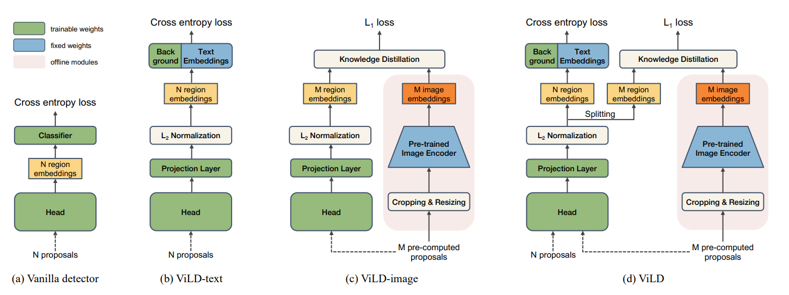
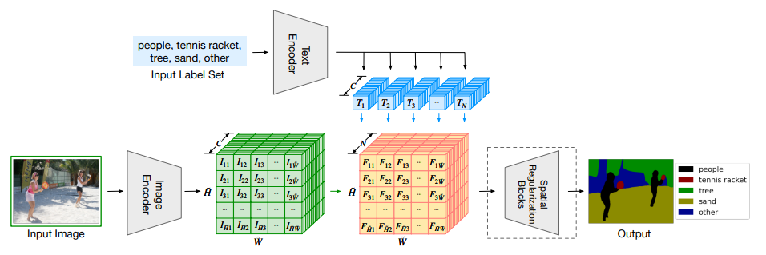
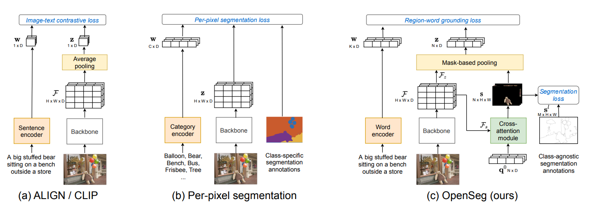
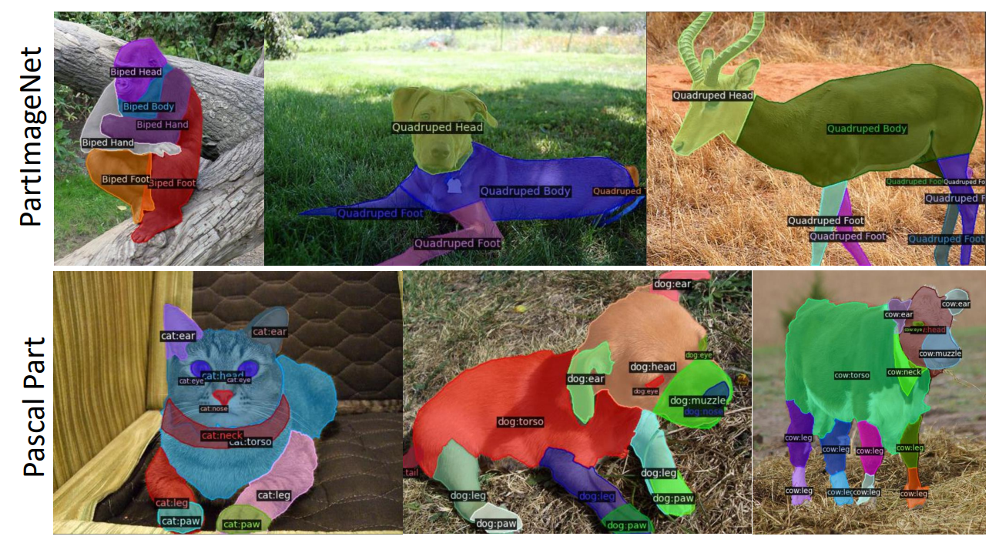
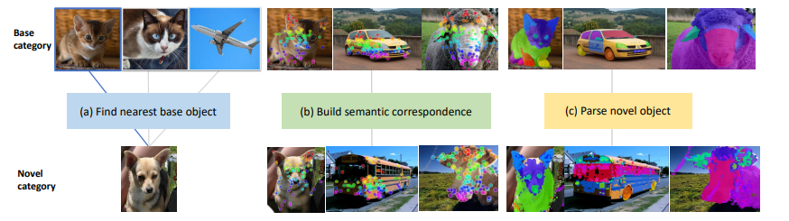

# Multi-modal Pre-training for foundational models (and Open Vocab Semantic Image processing)

The introduction of CLIP brought many attention to Vision-Language Pre-training, or VLP. The CLIP framework in general involves gathering large amounts of (image,text) data pairs and training a two-stream network with self-supervisision to learn the joint vision-language embedding that correctly matches the pair. The embeddings then may be used for zero-shot multi-modal transfer such as image classification and retrival. More recently it has led to open vocabulary vision tasks such as open vocabulary semantic segmentation and detection. This survey explores along this line of work.

*Last update date: 2023-10-25*

## (CLIP) Learning Transferable Visual Models From Natural Language Supervision
[[Paper]](https://arxiv.org/abs/2103.00020) [[Github]](https://github.com/openai/CLIP)

* 400M (image, text) pair collected from the web
* 500K queries (text search prompts) based on Wikipedia corpus, text in the (image, text) pair has at least one word(text) from the set of queries
* Image encoder and Language encoder trained with contrastive learning to learn joint image-langauge embedding space
* InfoNCE loss implemented by L2 normaliziing embedding and computing CE loss on image,vision similarity (i.e. cosine sim), loss is computed symmetrically to train both streams
* Various variants of ResNet and ViT have been tested for the image encoder
* GPT-2 used as text encoder
* Scaling laws observed here (in general, larger CLIP models perform better on average)
* Strong zero-shot transferability across multiple datasets, and also strong few-shot downstream transferability observed
* During inference, prompting can boost performance e.g. using template "A photo of a {label}." (On ImageNet this improved accuracy by 1.3%) instead of directly specifying label.
* Contrastive learning requires large batchsize for effective negatives sampling, which applies to CLIP as well. Authors trained CLIP with batch size over 32K. 


## (ALIGN) Scaling Up Visual and Vision-Language Representation Learning With Noisy Text Supervision 
[[Paper]](https://arxiv.org/abs/2102.05918) [[Blog]](https://blog.research.google/2021/05/align-scaling-up-visual-and-vision.html?m=1)


* Parallel Work to CLIP, has similar framework but focuses on learning from noisy data at scale (arguably data source used for ALIGN is much noiser than CLIP but has much larger scale)
* Trained on 1B (image, text) pair collected from the web.
* Uses minimal set of filtering - pornographic images and too small of (<200px) images ignored, images with too many (>1000) alt texts are discarded, and any images too similar to the test datasets(MSCOCO, ILSVRC-2012, Flickr30K) are removed to prevent leakage
* In terms of text, alt-texts shared by more than 10 images are also removed in order to prevent spurrious correlations (these alt-texts are typically things like 1920x1080), and too rare tokens (noisy broken texts such as image_tid_25&id msmad...)
* Same dual encoder (image, text) strucutre with multi-modal contrastive learning
* Various variatns of EfficientNet used as image encoder
* BERT with [CLS] token as embedding output used as text encoder (MLP projection head is added to match the embedding dimension between the two)
* Again, since contrastive learning is used it requires a large effective batch size, which in this case the authors train with batch size over 16K.
* Authors observe that ALIGN is much better than prior work (including CLIP) on inter-modal tasks with noticeable performances gains esecially on zero-shot transfer, but only shows comparable performance to CLIP on intra-modal performance (CLIP and ALIGN perform very similarly on zero-shot ImageNet classification)
* Perhaps expected, authors observe increasing performance with larger models, especially in vision, and actually observe quickly diminishing returns for the large scale data if the model is choice is not capable enough. It's shown that although the data may be noisy scaling both model and data still yields noticeable performance gains.
* Authors were also able to successfully learn a multilinguial version of the model for cross-language compatiblity, beating prior SOTA.

## (UniCL) Unified Contrastive Learning in Image-Text-Label Space
[[Paper]](https://openaccess.thecvf.com/content/CVPR2022/papers/Yang_Unified_Contrastive_Learning_in_Image-Text-Label_Space_CVPR_2022_paper.pdf)

* Motiviated by the fact that CLIP-based features hold diverse & broad information for zero-shot transfer to various tasks but do not have as discriminative features for downstream task as actual supervised learning, authors of UniCL extends CLIP, ALIGN, etc. by incorporating supervised labels into the CLIP framework
* Authors therefore attempt to combine transfer learning and self-supervised learning
* Authors achieve this with alignment of supervised labels and instance discrimination labels by putting them in all in the 'common image-text-label space'
* Pratically, this means the following for their framework:
```
1. Like CLIP/ALIGN the backbone outputs embeddings that are L2 normalized
2. Cossine simlarity + CE used for contrastive learning between embeddings (same loss & implementation as CLIP/ALIGN) --> also means they have symmetric (image, text) (text, image) loss calculation to get gradient both ways
3. In their extension, the contrastive loss is modified to also match the multi-modal embeddings in the case of the same supervised label i.e. image, text embeddings between different samples are still pulled together if they have the same label.
```

* It's to be noted that to when achieving step 3., the supervised samples are also naturally added to the SSL step by considering their image and the text ontology of the label as the matching pair i.e. for any supervised samples either use existing alt-txt or simply use (image, "image of \<class>").

* Method is analogous to supervised contrastive learning but UniCL is multi-modal and also as result trains separate encoderees for each input modality.

* Authors use a mixure of CIFAR-10(100), ImageNet-1K(22K), GCC-3M(12M), and YFCC-14M. This amounts to about 45 million images.

* Showed improvements over CLIP, even on zero-shot transfer.

* ((my thoughts)): Obvious drawback is that this process requires some portion of labeled dataset unlike pure SSL methods. Would this also scale better when aggregating multiple datasets and/or tasks e.g. extend to semantic segmentation datsets? Their experiments are somewhat difficult to draw conclusion from... their zero shot testing is from ImageNet 22K to 1K, they do show clear improvement over pure multi-task supervised transfer, so this joint label space learning is a postiive step forward but not sure by how much. Authors show easy performance gains by integrating additional data with SSL objecive to supervised pre-training, this seems to be a good practical step to build a stronger pre-trained model for later downstream tasks.

* ((TODO update)) It seems that while the experiments use the supervised label, technically it does not require explicit manual labels as demonstrated in Florence..


## Florence: A New Foundation Model for Computer Vision
[[Paper]](https://arxiv.org/abs/2111.11432)

* Florence is UniCL ran at much larger scale in hopes of developing a stronger foundation model

* First, Authors curate a 900M dataset mixture of publicly available images and generate (image, text, label) triplets for UniCL based pre-training. Labels are generated by finding common concepts based on the acquire text descriptions.

* Pre-training is done in 512 with A-100 (40GB) GPUs over 10 days

* As a data augmentation technique authors use prompt templates e.g. "A photo of the [[WORD]]".

* 1st stage pre-training: 224 x 224 image size with batch size ~24K, sequence length truncated to 70 approx. (language prompts included in dta)
* 2nd stage pre-training: 384x384 resolution (language prompts removed)

* Once they have pre-trained the model, the authors integrated various prior work on decoder/head networks architectures for various Vision and Vision+Language tasks, ultimately achieving new SOTA on over 44 benchmarks across recognition, image (video) retrival, object detection, VQA, and more.

* Florence is available through Azure cognitive services

# Open Vocabulary Perception

Vision-Language Pretraining methods such as CLIP and ALIGN has shown that embeddings may be developed to produce embeddings in joint vision-language space, and hence another line of work has been developing to then explore the use of such embeddings to detect and/or segment objects (things and stuff) with open vocabulary.

The main idea is similar between the following survey of works, where instead of a one-hot encded (or N-size probability distribution) vector for closed set semantic prediction, the output is converted to directly predict for the embedding dimension in the same space as the vision-language embeddings trained via CLIP, ALIGN, etc.

## (ViLD) Open-vocabulary Object Detection via Vision and Language Knowledge Distillation

[[Paper]](https://arxiv.org/abs/2104.13921)


<p align="center">

</p>

ViLD focuses on enabling open vocabulary object detection by utilizing as much information from CLIP/ALIGN as possible, and they achieve by incorporating both the text encoder and the image encoder trained by CLIP/ALIGN.

## (LSeg) Language-driven Semantic Segmentation
[[Paper]](https://arxiv.org/abs/2201.03546)

<p align="center">

</p>

* LSeg modified standard supervised learning framework for Semantic Segmentation to learn open vocabulary based segmentation.
* Ontology (semantic class names) fed through pre-trained text encoder i.e. GPT2 to generate per-class embedding
* To generate class-wise semantic probability masks, the dot product between image features and text features are computed to get N dimensional correlation map, which when normalized with softmax forms classwise N-dimensional probabiliy mask per pixel
* Embedding loss is done as relatively low resolution due to memory constraints. The spatial regularization block upsamples the masks for the final segmentation mask, which does so by upsampling the output with depthwise convolutions followed by non-linear activations and more depthwise convs with max pooling. 
* The whole model is trained with a standard cross entropy loss.


## (OpenSeg) Scaling Open-Vocabulary Image Segmentation with Image-Level Labels
[[Paper]](https://www.ecva.net/papers/eccv_2022/papers_ECCV/papers/136960532.pdf)

<p align="center">

</p>

* OpenSeg uses VLM text encoder e.g. CLIP/ALIGN to process open vocabulary
* Class agnostic mask generator is trained on supervised data, or may use a pretrained model e.g. SAM
* Features extracted from the backbone with masks fed through a cross-attention module with masks to generate mask with text embeddings
* The key learning process of OpenSeg is the <b>region-word grounding loss</b>, where the mask(region) embedding and text embedding are fed through the contrastive loss for embedding alignment, thus giving it the open vocabulary semantic segmentation capabilities.
* OpenSeg significantly out-performs LSeg on several benchmarks e.g. COCO, PASCAL.


## (VLPart) Going Denser with Open-Vocabulary Part Segmentation
[[Paper]](https://arxiv.org/abs/2305.11173)

<p align="center">

</p>

VLPart further expands capabilities of open vocabulary semantic segmentation by creating a data engine that creates labels for object parts, therefore training a segmentation model with all (scene, object, part) levels of annotations.

<p align="center">

</p>

* New object parts labelled by first gathering source dataset (what was used to trained the source open vocabulary segmentation model)
* For new objects nearest objects from source dataset are mapped to borrow their taxonomy
* Object part segmentation with DINO applied to then segment and map object part labels to the regions
* Newly parsed objects then added to the dataset for training of final segmentation model VLPart.