### *None of the discussed/presented works in this page are work of my own, for details check links for each paper.*


# Algorithmic Perspective on Imitation Learning


# Survey on Imitation Learning for Autonomous Driving

**Behavior Cloning** (BC) is the simplest IL algorithm out there, where imitaion is achieved by treating the problem as supervised learning and training an agent that learns to exactly copy the provided demonstration data. i.e. learn parameter $\theta$ such that

$\theta = argmax_{\theta} \sum_{(s,a) \in D} p_{\theta}(a | s)$

However, BC is commonly challenged by the problem of covariate shift, where it can only perform as well on the distribution of states that it is familiar with, and quickly collapses to complete failure when it encounters unfamiliar state. For instance, as error accumulates over time the BC policy will likely deviate farther and farther away from the state distribution it has experineced through data, and as result perform worse and worse over time.

A wide array of work has been proposed to migitate this issue of covariate shift, and it is still an open problem. 

inertia problem - if policy relies on ego trajectory, when arriving to a stop due to a red light it may never laern to be able to start moving again after the light has turned green, as it creates incorrect spurious correlation between low speeds and acceleration.

CCIL[x] , verifying their method on the Lyft[x] and nuPlan[x] dataset, in particular demonstrates the importance of using vector representation and removing ego state information from the motion planner.

A largely concerning but interesting phenomena is that instantaenous planning accuracy and long-terming plannin accuracy are very weakly correlated, and hence an improvement in one aspect does not mean an improvement in another. (CCIL, codevilla et al.)

## ChaffeurNet

* BC with set of auxilliary losses designed to encourage the ideal driving behavior

## CIRL: Controllable Imitative Reinforcement Learning for Vision-based Self-driving
[[ArXiv]](https://arxiv.org/pdf/1807.03776.pdf)

<p align="center">
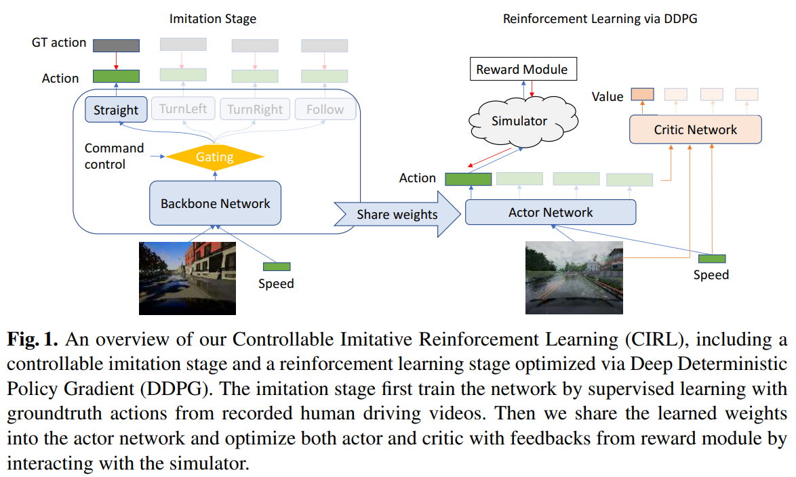
</p>

* 


## End-to-End Urban Driving by Imitating a Reinforcement Learning Coach
[[ArXiv]](https://arxiv.org/pdf/2108.08265.pdf)

* Motivation to maximize use of simulation to generate a "teacher" that can take the role of human expert for demonstrations
* Issue: Expert demonstrations are expensive, while the default autopilot in simulations such as CARLA are rule-based and therefore limiting in performance
* Goal: Train roach, RL based coach teacher network that uses privileged information and RL to get highest performance possible on sim, and distill its behavior to IL agent without the previleged information. Assuming feasible sim2real domain transfer or at least pre-training of, this would allow simulations to provide high-performing IL agents that could be transferred to the real world
* Method: Roach uses ground truth BEV semantic Map with ego vehicle kinematics as input, trained with PPO to create high-perforance RL agent. IL student is supervised with Roach with DA-RB(CIRLS + DAGGER), although technically any IL method would apply
* IL agent is distilled to have matching action distribution as roach through KL divergence loss.
* Benchmarks on CARLA show that fine-tuned Autopilot and roach (proposed method) have competitive success rates while roach has slightly higher driving score overall, showing RL can be further adopted to improve the teacher policy
* Authors note that "The performance of an IL agent is limited by the performance of the expert it is imitating." Yes but it's interesting future research direction to extrapolate beyond sub-optimal demonstration.
* Noticeably, despite similar performance between tuned AP and Roach, during IL training the agent trained on AP performs significantly worse on new town/new weather scenarios. It is best understood that this is likely due to the mismatch of policy between AP, which is rule-based, to Roach which is a similar learned policy as the student. It's also to be noted that roach/student is model-free and does not use any dynamics model. Same setup with roach works muh better, while additional losses further improve generalization performance.
* Roach is trained with PPO, with BEV semantic map (cyclists, cars drawn as bounding boxes, road lanes & traffic, intended routes, etc.) and kinematic state as input vector e.g. steering, throttle, brake, grear, velocity. Student is only given camera input, speed and intended direction.
* Q: Could we get even more competent, super-human driver as RL agent?

## Embedding Synthetic Off-Policy Experience for Autonomous riving via Zero-Shot Curicula
[[Paper]](https://arxiv.org/abs/2212.01375)

* Authors consider the problem of upsampling long tail for training policy robust to rare, safety-critical scenarios.
* It is difficult to identify challenging scnearios from given dataset <i>a priori</i>, and hence authors propose training an embedding model + classifier to identify challenging scenarios in a zero-shot setting

## CCIL: Context-conditioned imitation learning for urban driving
[[Paper]](https://arxiv.org/pdf/2305.02649.pdf)

<p align="center">
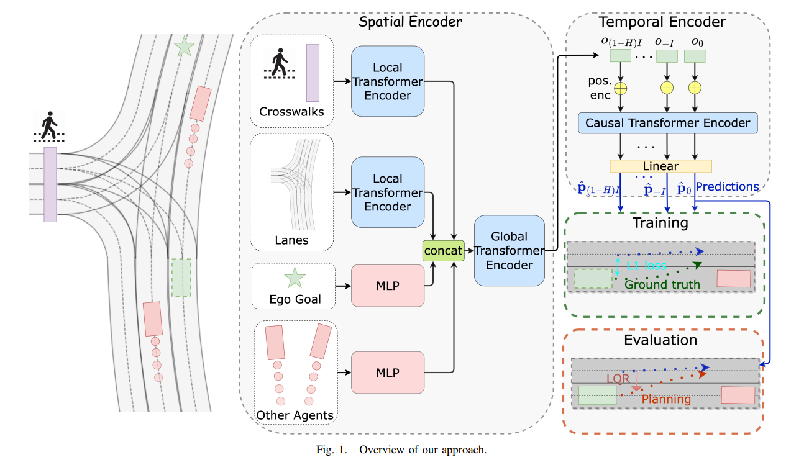
</p>

* State encoder: uses VectorNet-like local, global attention to process vector state representation as input
* Temporal encoder: Uses causl mask with transformer to process state embeddings auto-regressively until H horizon trajectory is output by MLP at the end
* Theoretical Analysis (which I only understood partially) essentially shows that given policy output boundedness and mild input-to-state stability, the proposed method of BC stability is guarenteed. i.e. with some stability assumptions they argue that method that only depends on the scene context and not the ego history is guarenteed to perform robustly.
* Towards resolving the covariate shift problem introduced in BC, authors propose <i>ego-perturbed goal-oriented coordinate system</i>
* The loss function includes L1 loss on forecasting T future poses, auxilliary loss on history H for each of the T future poses (based on the causal mask), and L2 norm regularization. Intuitively, the aux loss encourages the causal transformer to fix previously predicted pose when predicting the next future pose.
* LQR planner used as post-processing step to smoothen the trajectory
* IMO, the key novely is the carefully engineered removal of the ego pose information, as the BC loss and encoder are previously explored before, whereas the ego pose removal specifically differs this method from the rest. By removing any ego-state based information, the policy becomes robust to any compounding errors and is therefore able to recover much better than prior work.

What does the CCIL theoretical analysis tell us?

**show final guarentee here**

The final guarentee shows that given the context system is stable and the norm of policy is small then the closed loop driving system is guarenteed to be stable.

The above condition is met while removing the ego state from input to the feedback control loop, thus does not necessarily require ego state trajectory as input, which in practice also influences the model with covariate shift.

## Imitation Is Not Enough: Robustifying Imitation with Reinforcement Learning for Challenging Driving Scenarios
[[Arxiv]](https://arxiv.org/pdf/2212.11419.pdf)
* Introduces BC-SAC, combination of Behavior Cloning for imitative behavior learning and Soft Actor Critic for using RL to train robust behavior
* IL methods such as BC are limited by distribution shift, where model performs only as robustly when encountering familiar states taht it has observed through demonstrations, and start to experience severe performance degration when entering unfamiliar states (the problem typically known as covariate shift). The problem worsens as compounding model error leads to continous deviation from in-distribution states to out-of-distribution states.
* Therefore, while IL is scalalable and simple yet effective, it significantly lacks mechanisms to provide robustness in terms of safety and reliability, especialyl for complex and potentially dagnerous scenarios where demonstration data collection is challenging.

<p align="center">
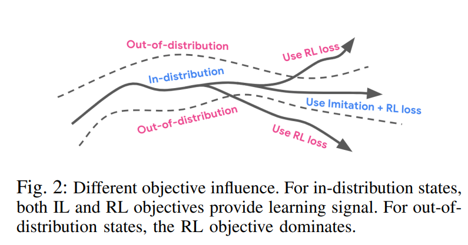
</p>

* BC-SAC therefore augments with RL training to make it more robust to OOD states by reinforcing it to learn general safe driving behaviors with the RL objectives e.g. collision avoidance, on road driving, proximity to reference trajectory, etc.

* Because RL explicitly optimizes for a reward function it is able to learn robust optimal behavior, while also training in the closed-loop fashion ensures it learns the causal relation between (s,a) and resulting state s'. The major drawback to using RL only is the difficulty of good reward design, where IL can contribute by providing in-general good behavior through demonstrations while RL loss explicitly guides safe and intended beavior for out of distribution scenarios for improved reliability and safety.

* The proposed BC+SAC algorithm then utilizes a mixture of IL and RL objective to train policy $\pi$ that maximizes the mixture utility function:

<p align="center">
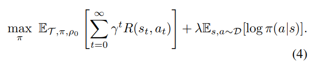
</p>

* Augmenting SAC, the BC objective is added to the expected Q value from the critic, hence the actor receives signal from both objectives

* In terms of RL, very simple and straightforwward objectives are considered: collision and off-road.

* In terms of IL, expert actions are recovered from trajectories using inverse dynamics model with the bicycle model.

* Experiment using 100K miles of proproeitary driving logs, where
```
1. 10s segments
2. scenario rarity estimated with prior work
3. State based on features from perception system's output (lane graph, deteceted road users, traffic light, ego trajectory, etc.)
4. Baselines: BC(open loop), MGAIL(closed loop), SAC (RL-only)
```
results show that
```
1. BC-SAC consistently achieves lowest failure rates, while BC-SAC trained on top 10% challenging scenarios perform better than that trained on all scenarios
2. BC-SAC consistently outperforms BC and MGAIL on all types of scenarios, evaluated across each 10th percentile (0-10, 10-20, ..90-100) of scenarios based on difficulty
3. Denser reward (proposed compared to binary fail/success) works much better, while putting too much weight in either IL/RL leads to sub-optimal performance.
4. Careful analysis shows in 80 samples show that many collisions for BC-SAC may be due to divergence between the log and the agent's trajectory, where because the simulation is non-reactive would result in a collision. Running the logs with reactive agents may reduce errors in this case.
```


## Goal Conditioned Imitation Learning
[ArXiv](https://arxiv.org/pdf/1906.05838.pdf)

* 

## Deep Imitative Models for Flexible Inference, Planning, and Control
[[Paper]](https://arxiv.org/abs/1810.06544)

<p align="center">
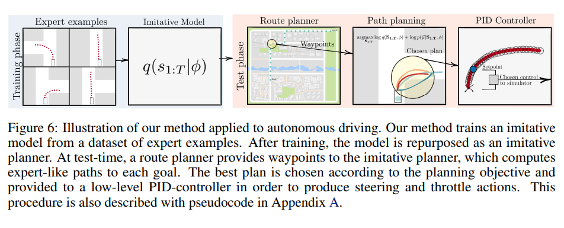
</p>

<p align="center">
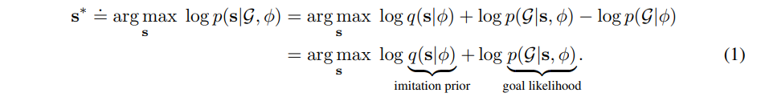
</p>

* Attempts to combine the robustness of model-based RL (MBRL) that can adapt to new complex goals and the human preference & alignment provided by generative imitation Learning (IL) for learning Autonomous Driving Policies

* Method combines the two to conduct 1) stochastic policy trajectory generation to generate not only possible but preferred set of trajectories via likelihood 2) trajectory selection via additional cost optimization during test time, such that the final chosen trajectory is feasible, human-preferred, and safe.

* The imitation prior is goal-less, simply learned to generate trajectory likliehood following human behavior. Authors use R2P2 here but technically any trajetory forecasting (generative) model would work.

* Authors demonstrated its ability to adapt to new goals by showing robust pothole avoidance achieved by adding new cost variable to the optimization objective.

* For MBRL the set of waypoints from route planner in GPS is used to generate either 1) waypoints, 2) line segments given waypoints, or 3) goal region extrapolated using the line segments as goal region to the model. Goal varialbe $G$ is defined using said either of the goal conditions to define the goal likelihood.

<p align="center">
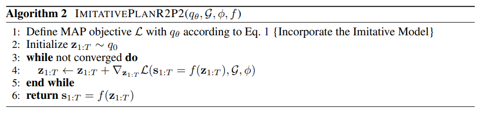
</p>

* Equation 1 is optimize by running gradient based optimization (MAP inference) in the latent space for z that is fed as latent variable to the Imitative model. Essentially, the best set of latent variables that produce trajectory distribution that maximizes log likliehood of imitation prior and goal likelihood is found.

* The planned trajectory is executed by PID, which is commonly done.


## Model-Based Inverse Reinforcement Learning from Visual Demonstrations
[[ArXiv]](https://arxiv.org/abs/2010.09034)

<p align="center">
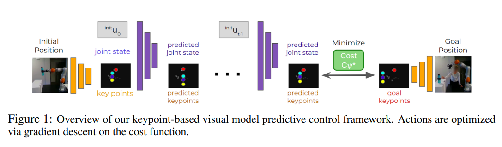
</p>

* Proposes novel IRL method for manipulation based on compact keypoints representation

* Self Supervised Keypoint Detector used to process all visual obserations into keypoints (with tracking)

* Trained a visual dynamics model to predict robot joint state and keypoint locations given current frame of (keypoints, joint state) information with control u.

* Updated IRL method to flow gradient between cost function and policy network for more stable learning than original feature matching method (with decoupled reward/action networks). Planning is done my visual MPC.

* In particular, the IRL loss is not the standard feature matching loss but instead per-timestep distance between demonstration and exeuted trajectory's keypoints: $\sum_{t}(z_{demo}-\hat{z})^{2}$. Hence this softer loss assignment probably helps with the fully differentiable learning process.

* Demonstrated more stable learning with few demonstrations (1-10) compared to hand-designed default cost and Apprenticeship Learning.

* Limitations (includes authors' discussion): the visual side of system is very restrictive - fixed set of keypoints with the lack of robustness, fixed viewpoint, lack of semantics, all are possible diretions for improvement. The demonstrations also specifically rely on moving the robot and using the proprioceptive joint state information. It would be a big leap forward if relative demonstrations where humans are just doing the task could be later used by the robot observing them to later adapt it to themselves. The method is restricted to unary tasks and supporting muti-task learning would be an interseting furutre direction.

## (LAV) Learning From All Vehicles
[[Paper]](https://openaccess.thecvf.com/content/CVPR2022/papers/Chen_Learning_From_All_Vehicles_CVPR_2022_paper.pdf) [[Code]](https://github.com/dotchen/LAV)

* Improving data efficiency by not only using the ego vehicle trajectory but surrounding vehicles to learn driving policy
* viewpoint-invariant perception trained to robustly handle partial observations that would allow interaction with observations from both ego data (original) as well as other vehicles on road i.e. the representation passed to motion planner should not differ between ego and other vehicles
* Authors use metric map representation i.e. ROI pooled bev map with vehicle at center

<p align="center">
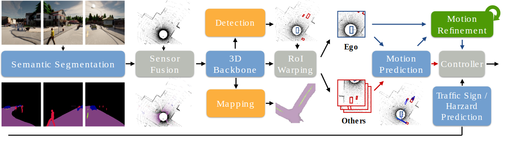
</p>

* privileged teacher trained in sim and distilled to student for final end-to-end driving policy
* Perception fuses image lidar by point painting i.e. paint lidar with 2d seg mask labels
* other perception losss (road & lane segmentation and vehicle/pedestrain detetion) provie supervisory signla to help learn robust representation transferable across ego and other vehicles
* motion planner is deterministic RNN outputing trajectory, basically trained via Behavior Cloning
* refinement network traine to recursively predict residual
* Motino Planner first trained with privileged ground truth information to build strong prior on driving before adapting it to handle output from the 3D backbone. The privileged motion planner is used to provie distillation labels for the student.
* PID controller executes trajectory following given the plan from the motion planner.

## Rethinking Imitation-based Planner for Autonomous Driving
[[Paper]](https://arxiv.org/abs/2309.10443)[[Website]](https://jchengai.github.io/planTF/)

* Reaffirms the understanding that utilizing past ego trajectory leads to significant closed-loop performance degregation.
* Necessary features for ego motion planning:
```
1.  Ego history may improve open loop evaluation but at the cost of significant drops in closed loop performance. The benefit may also only exist for easier driving scenarios. Therefore, authors conclude that historical ego state information is unncessary.
2. Even without the history, providing current kinematic states (velocity, steering, acceleration in particular) can still lead leaking some information and leading to the shortcut problem. To alleviate this issue, authors suggest State Dropout Encoder, which 
first processes each state input with an embedding but drops them with random probability (position and yaw are never dropped). This helps model build robustness to exploiting kinematic state information.
```
* Reducing Compounding Errors (observations on augmentation):
```
1. if using perturbation on ego pose, renormalization is needed to show full benefits
2. Providing corrected future trajectory after augmentation does not help(this aspect seems a bit weird since I thought learning recovery behavior would be helpful..) --> thinking more on this, it makes sense since the corrected trajectory is unlikely what the human driver would be in such case i.e. the trajectory distribution does not match with that of data/expert.
3. Gap between predicted trajectory and the ability to actually follow the trajectory may lead to further drop in performance. e.g. using RL agent instead of LQR may show performance improvement. (IMO: although this is a valid point, this is something that cannot be tested in simulation easily, while something like system ID w/ dynamics modeling might be good enough)
```
* The proposed PlanTF baseline makes the following decisions
```
1. Uses state6 setting: ego xyz, yaw, acceleration, velocity, steer with State Dropout Encoder (still does not use any historical informaion of ego kinematics)
2. As augmentation state perturbatino is applied (ego state randomly translated and rotate by some degree). Expert trajectory is not modified.
3. The overall learning framework is still Behavior Cloning, it just has the added SDE with ego trajectory information removal, and the data augmentation.
```

* Proposed PlanTF model significantly outperforms other learning based models on both open loop and closed loop evaluation, while even beating PDM-Hybrid on some scores. 
* Unfortunately, still not a clear winner given all aspects to evaluate, but a promising model nonetheless.


## Predictive Driver Model: A Technical Report
[[Paper]](https://opendrivelab.com/e2ead/AD23Challenge/Track_4_CS_Tu.pdf) [[Code]](https://github.com/autonomousvision/tuplan_garage)

* Technical report by the authors of the winning method for [nuPlan Challenge 2023](https://www.nuscenes.org/nuplan)
* The PDM report, like few other works (TODO: cite), observed that there exists a dichotomy between open loop and closed loop evaluation. In particular, they observed that methods focusin on closed loop performance (e.g. rule based planner) excels in CLS (Closed Loop Score) but poorly on OLS (Open Loop Score), while it's the opposite for methods on open loop evaluation (e.g. BC).
* Authors observed best performance by interpolating short-term trajectory from a modified IDM (Intelligent Driver Model) and long-term trajectory for a learning based model GC-PGP.
* Short-term planning module focuses on MPC + IDM variant for closed loop performance. Dijkstra with lane lenghts as cost, forecasted objects w/ traffic light as occupancy map. The PDM "scoring considers at-fault collisions, driveable area infractions, and driving direction compliance as multiplicative metrics. Furthermore, the scoring evaluates progress, time-to-collision, and comfortability as weighted metrics"
* Emergency break override does exist for PDM
* GC-PGP++, a learned latent variable trajectory forecasting model, estimates long-term trajectory sampled from its output probability distribution
* For the final output, short term prediction is decied by the short-term planning moule output while the rest follwos prediction from GC-PGP++.

## GAIL:

Analogous to GANs, Generative Adversarial Imitation Learning propose learning a discriminator that learns to distinguish expert and learner state actions, while the generator learns to generate actions that best mimic the expert i.e. policy.

- Downside is that the learned reward fucntion from the generator is non-staionary, it learns conditioned to the generator and therefore cannot be used as the global stationary reward function to optimize RL towards.

## IQ-Learn: Inverse soft-Q Learning for Imitation
[[Code]](https://github.com/Div99/IQ-Learn) [[Project]](https://div99.github.io/IQ-Learn/)

<p align="center">
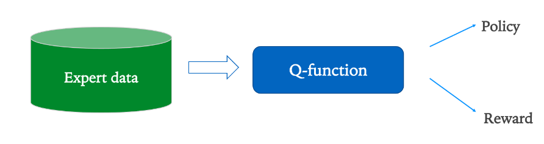
</p>

<p align="center">
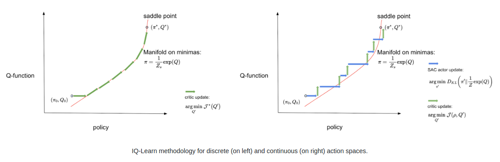
</p>

* Key insight: perform Imitation Learning by learning to estimate the *Q values*
* Theoretial proof provided by the authors show that the Q values the reward values are bijective, and therefore once the Q values are learned the reward values can be recovered. Meanwhile, additional proof also shows that optimal policy for given reward function is the boltmann distribution conditioned on the Q values, and therefore *learning the Q value recovers both the reward and the policy*
* Above shift in paradigm implies that rather than the original minmax problem setting of IRL (that involves forward RL and IRL step) is replaced by learning of Q value alone
* Prior work on BC fails to utilize environment's dynamics, while GAIL is unstable in optimizing due to its adversarial nature, and IRL is limited by the min-max problem over reward and policy. GAIL, IRL, and related methods are fundamentally problematic due to the requirement of separately modeling the reward and policy.
* The introduced Inverse Soft-Q Learning requires minimal implementation with modification of Soft Q Learning (for discrete action space) or SAC (for continuous action space) algorithms "in fewer than 15 lines of code."

<p align="center">
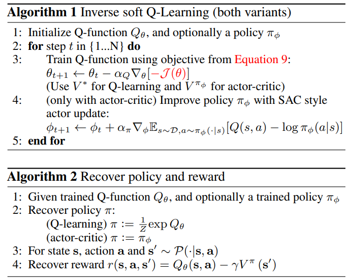
</p>

* Framework learns "energy based moels for the policy similar to soft Q-learning and later learn an explicit policy similar to actor-critic methods"
* Framework involves choosing a regularizer, whihc depends on desired reward functino properties and choice of statistical distance measure.
* V* is exactly recovered for Q learning which has discrete action space, but for continous action space with SAC V is estimated with optimal policy based on Q.

* Key advatnages are then more stable learning and consequentially more robust of hyperparamter tuning, supports both offlien and online setting, and more scalable to large scale experiments.

### Discrete Scenario (DQN)

### Continuous Scenario (SAC)


## Safe Real-World Autonomous Driving by Learning to Predict and Plan with a Mixture of Experts


* MoE used to generate K discrete trajectory distribution for ego vehicle planning & road agents trajectory prediction

* Trained and tested on proprietary dataset, but does test their prediction capabilities on the Lyft Level 5 dataset

## Symphony: Learning Realistic and Diverse Agents for Autonomous Driving Simulation
[[ArXiv]](https://arxiv.org/pdf/2205.03195.pdf)

<p align="center">
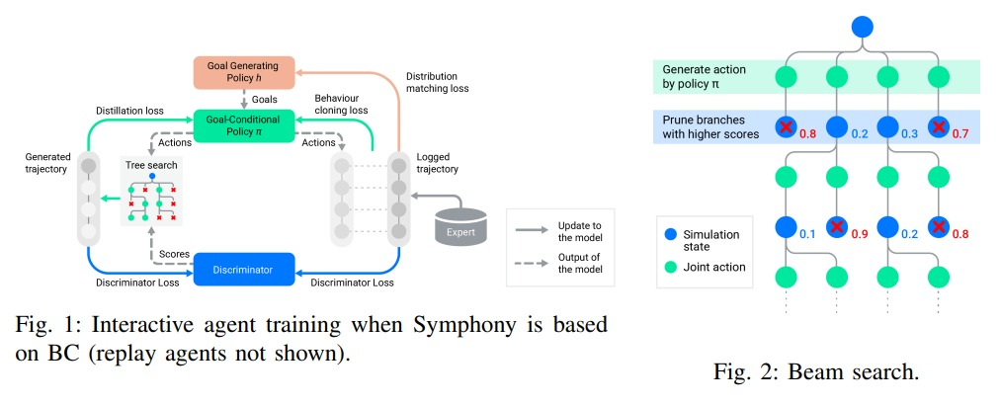
</p>

* To generate realistic but diverse agents, Symphony modifies standard BC or (M)GAIL in two following ways:
    1. Parallel beam search to rollout trajectories from IL agent to generate more realistic trajectories, which can also be used as supervision for the IL agent,
    2. Hierarhical setup of goal planning and goal conditioned IL - a separate policy is trained to predict goal (reference trajectory in road graph) and generate goal-conditioned trajectory with IL agent (BC, GAIL) separately. This allows ensuring that the beam search does not result in mode collapse as there will be multiple goals the policy can condition on to generate its trajectory during the search.

* Problem setting is a **multi-agent** *Markov Game* - within single scene observation there are multiple interactive agents, and their actions have to be predicted jointly. In this paper the policy is agent-wise factored i.e. $\pi(a_{t}|s_{t}) = \prod_{i=1}^{N}\pi^{i}(a_{t}^{i} | s_{t})$ (input state $s$ is processed for each agent accordingly although agents would be in the same scene e.g. normalizing cooridnates)

* Main difference between Symphony and other works: most other works in IL or trajectory forecasting have problem settting that does not allow for rollout to observe the future in a way that Symphony does, mainly because observation into the future is not possible at inference time and part of the goal is to infer exactly the possible future. However, Symphony's main focus in building realistic and diverse agents in teh simulation setting, and therefore does not actually have to meet this constraint.

* When running symphony, interactive agents' **joint** actions are selected with the trained IL policy, while the rest can be rolled out by simulator as default.

* Transition function (dynamics) considered known because everything is done in sim.

* Symphony is tested with three realism metrics: collision rate, off-road time, and ADE

* Authors also propose minSADE to test diversity - essentially simulation is used to populate m  possible trajectories and caclulates minADE per trajectory, thus checking whether the possible trajectories rolled out by Symphonyc covers them all

* Results show Symphony predicts realistic and diverse trajectories better than baseline BC/GAIL.

---
<!-- <p style="font-size:11px">Page template forked from <a href="https://github.com/evanca/quick-portfolio">evanca</a></p> -->
<!-- Remove above link if you don't want to attibute -->


# Mobile ALOHA: Mobile ALOHA:
Learning Bimanual Mobile Manipulation with
Low-Cost Whole-Body Teleoperation
[[Paper]](https://mobile-aloha.github.io/resources/mobile-aloha.pdf)

* developed mobile ALOHA, a bimual robot puppeteer system augmented with a mobile base platform to allow for teleoperation involving not only manipulation but also navigation for more complex, whole body action imitation learning.
* "simply concatenating the base and arm actions then training via direct imitation learning can yield strong performance."
* aggregated static bimanual dataset from original ALOHA with newly collected mobile ALOHA dataset from the RT-X release to show positive transfer (co-training improvements)
* arm joints and base kinematics (linear, angular velocities) as a joint action space
* The static ALOHA dataset has fixed background withthe robot placed over tabletop, and with some of its joints fixed to be facing forward towards the table. Thus is provides some experinecefor the robot to learn but involves much smallet set of capabilities
* IL model trained with approaches including ACT, diffusion policy, and VINN

<p align="center">
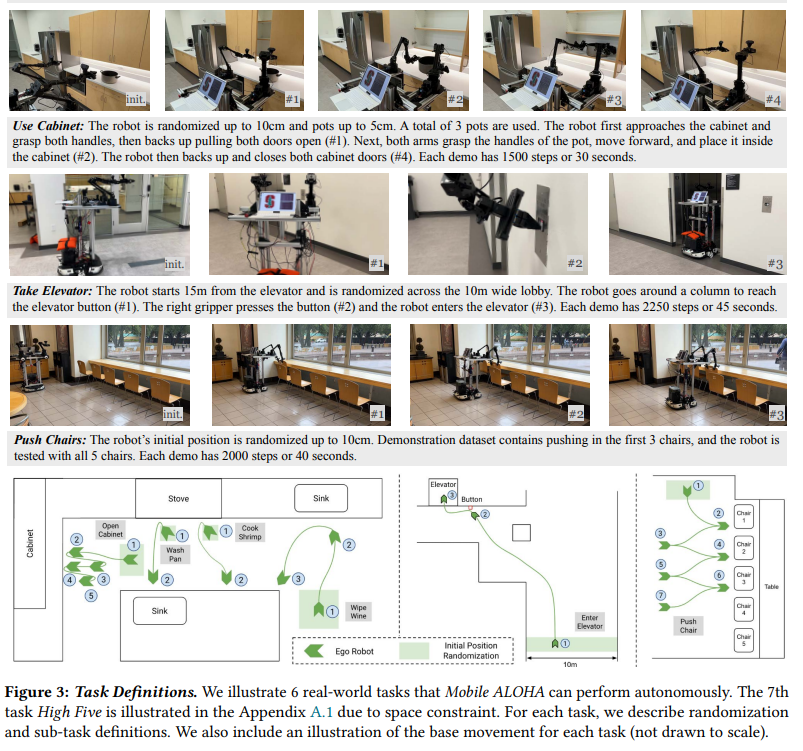
</p>

* tested on 7 tasks total, each demo lasts around 20-50 seconds.
* Each task has various mobile manipulation requirements
* Authors found action chunking (predicting sequence of actions instead of a single action) to be crucial to its success - this seems somewhat analogous to learning skills for hierarhical IL
* co-trainig can boost performance of policies with over 90% success rate for most tasks when applied to ACT
* However, co-trainibenefits are not universal as it shows positive transfer for ACT and Diffusion policy but not VINN, which showed mixed results
* Co-training also showed robustness to data mixture (between static and mobile ALOHA datasets), and showed better data efficiency to number of demonstratoins --> many demonstrations must have some cross-task knowledge transfer
* results also show pre-training < co-training for the same dataste mixture, implying former approach may be suffering from forgetting issue.

## CCIL: Continuity-Based Data Augmentation for Corrective Imitation Learning
[[OpenReview]](https://openreview.net/pdf?id=G6IjuZWBEz) [[ArXiv]](https://arxiv.org/pdf/2310.12972.pdf)

## Can Autonomous Vehicles Identify, Recover From, and Adapt to Distribution Shifts?
[[ArXiv]](https://arxiv.org/abs/2006.14911)

<p align="center">
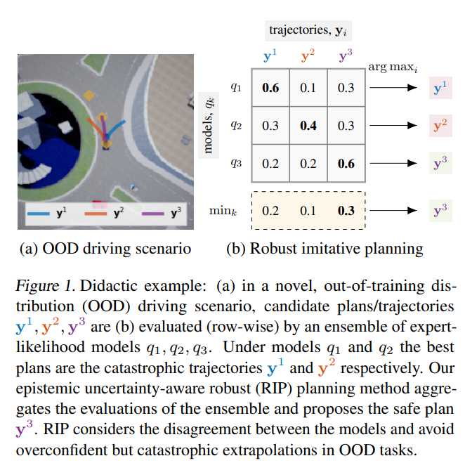
</p>

* Extending from Deep Imitative Models, incorporate uncertainty in imitative planning by using deep ensemble model to represent posterior $p(\theta | D)$, and proposes adopting two different methods to utilize the model posterior and imitative prior $q(\tau | X, \theta)$ for trajectory $tau$, sensor input X, and model $\theta$ for robust planning
* Worse Case Model (RIP-WCM) always considers least likely imitative prior for any chosen path and thus optimizes the following: 

    $\argmax_{y} \min_{\theta \in supp(p{\theta | D})} \log q(y | x;\theta)$

* The Model Averaging (RIP-MA) model uses bayesian uncertainty posterior to optimize over imitative prior weighted by their model posterior:

    $\argmax_{y} \int p(\theta | D) \log q(y | x; \theta) d\theta$

* In practice the integral is intractable and hence the discerete K ensemble approximate is used based on the deep ensemble model

* Proposed Robust Imitative Planning not only improves performance of planning in general, but in particular excels in planning in novel scenarios (perceptually similar but goal task requires more challenging scenarios such as roundabouts, right-angle turns and hills)


* For further improving OOD performance authors propose Adapative RIP that accepts user demonstration for online optimization. Upon encountering very high epistemic uncertainty, RIP "queries the human driver for feedback, which is then used to update its parameters online". This DAgger style learning allows further adapatatino to the scenarion at hand, although other limitations such as catastrophic forgetting is out of the scope of this paper.


## Perceiver-Actor: A Multi-Task Transformer for Robotic Manipulation
[[Arxiv]](https://arxiv.org/abs/2209.05451)

<p align="center">
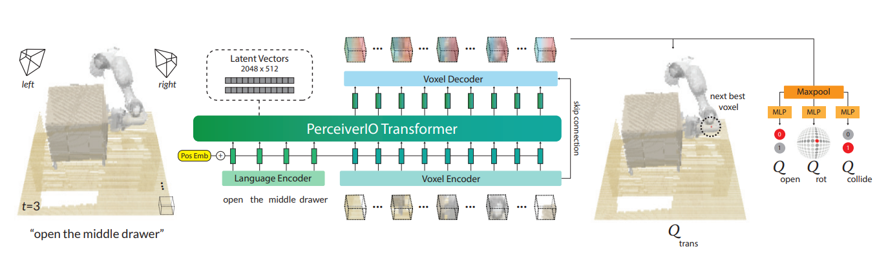
</p>

* keypoint based visual maniuplation model based IL agent.

* Improves over the CLIPORT method by consider 3D voxel input to extend its capabilities beyond table top fixed viewpoint, and also uses the transformer arctheicture with multi-task leraning for scalae task trasnsfer and robustness.

* Uses (perceiver) transformer architecture for scalability

* Natural language instruction grounded for generalizability (uses pre-trained CLIP text enoder for weight initialization)

* patches of voxels + tokens from instruction processed by the transformer model to decode action

* Discrete aciton space - voxel probability outputs translation, MLP after pooling predits rotation, gripper open/close, and collision mode (off for just moving arm around, on when havingto move arm with object grasped) trained to predict with classification like loss under BC setting. This setup is known as action-centric representation

* Discrete time space learned by detecting key frames and processing the motion between pairs of keyframes as transitions - any point in demonstration where the end effector (robot) is fully stationary is detected as the keypoint frame

* Voxel is proposed as compat but expressive representation

* Since data is scarce for 

* Prior Work C2Farm also uses voxel representation but uses 3D CNN

* Good performance shown for simulation with 18 language-conditioned tasks with over 200 variation, and also showed SOTA perforamnce for real life experiments with only 53 deonstrations for 7 tasks total, showing good data efficiency. 

* task variation is balaned in terms of number of samples per batch to prevent over-fitting to a specifi task when training a single multi-task agent

* Testing does not involve novel objects, but does involve novel scenes and task variations.


## RVT: Robotic View Transformer for 3D Object Manipulation
[[Project Page]](https://robotic-view-transformer.github.io/)

<p align="center">
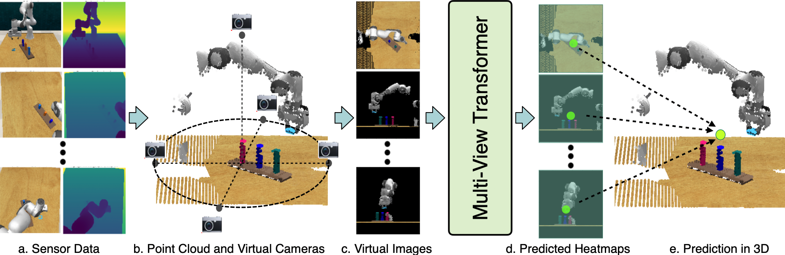
</p>

* Extension of PerceiverActor to focus on the perception /  representation learning

* PerAct showed using 3D reprsentation compared to Image(2D) greatly improves object manipulation performance, but this also generates larger compute cost and $O(n^{3})$ complexity

* RVT makes learning much more efficient and scalable by representing the scene as a set of multi-view images, and passing that as input to a <i>Multi-View Transformer</i>.

* RVT overalled showed 26% higher success rate and 36x faster training time.

* Given 3D reconstruction with (one of more) RGBD, 3 renderings with up to 7 channels: RGB, depth, xyz coordinate of pixel in world frame are rendered as input to the agent.

* Output representation is similar to PerAct, but for translation, because RVT does not have 3D voxel grid reprsentation it instead predicts heatmap per image that is then rendered to 3D space for the exact location.

(Add Figure 3)

* During training, model is exposed to various types of camera rendering in terms of poses and types (perspective, orthographic) in order to support varius views at inference time.

<!-- ## contradicting points on action space between RT2 and ALOHA -->
<!-- * RT2then training via direct imitation learning can yield strong p authors said concatenating mobility and manipulation action space does not transfer well
* ALOHA authors say that "simply concatenating the base and arm actions erformance." -->


# In my opinion...
* World model should be considered as it can not only compress current state representation but also can forecast the future and hence either provide forecasted states for planning or visulization for the humans. Additionally, this world model should be conditionally geenrative i.e. use latent coes and/or ego motion intent to add as condition
* vector space world model seems interesting
* I also agree that planner should not use historical ego trajectory, since it just becomes too challening to prevent the shortcut problem.
* To make everything learnable, we could have something like PI-Net.
* For model training to scale, there should be more effort towards data aggregation and multi-source training


# References
https://ai.stanford.edu/blog/learning-to-imitate/