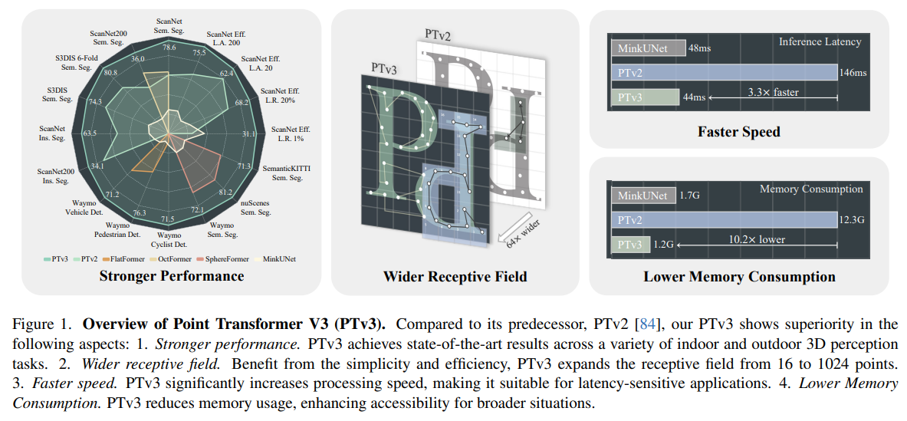
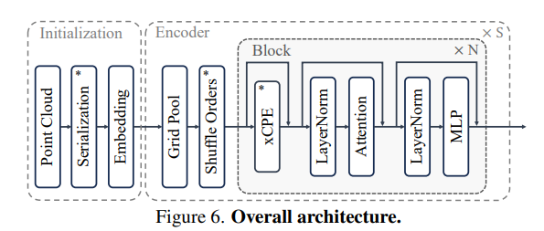

# LiDAR Perception - 

## Point Transformer V3: Simpler, Faster, Stronger
[[ArXiv]](https://arxiv.org/pdf/2312.10035.pdf) [[Code]](https://github.com/Pointcept/PointTransformerV3)

* Point Representation is the most fine-detailed representation but it is mostly challenged by difficult to scale in terms of scale - finding set of neighbors for feature aggregation requires expensive random memory access while high resolution implies many parameters are needed to grow effective receptive field.

* PTv3 proposes a set of improvements on point transformer with  a wider receptive field, faster speed, and lower memory consumption, thus achieving higher performance by focusing on efficient scaling rather than complicated network design, something that has been not as well explored in 3D LiDAR perception.

* Motivation: model performance is more dependent on scale than design i.e. more data and more parameters yield best performance, and thus this scale needs to be achievable efficiently

* Increasing receptive field efficiently with sparse convolutions is a challenge, while point transformers are limited by permutational invariance i.e. finding local neighborhood of points via methods such as KNN is expensive and slow.

* Breaking permutaion invariance: because KNN itself is so slow, the permutation invarinace paradigm is broken to consider point set in a serialized format. A space filling curve that travels through 3D space such as Z-order and Hilbert curve provides arbitrary ordering to points that also approximately adhere to local geometry. Once the serialization and indexing is done, it is possible to to treat them as structured represntation and hence applying window attention, patch attention with grouping, etc all becoems possible with good efficiency.

* Architeture is similar to standard enoder transformer network - after serialization embedding based on the order(position w.r.t curve) is applied

* Each block has an enhanced conditional positional encoding (xCPE) that is basically a large kernel sparse convolution layer

* Similar to Swin, order can be shuffled to aggregate different points

* PTv3 outperforms Cylinder3D, MinkUNet, etc on nuScenes, semanticKITTI and Waymo Open Dataset, thus showing its scalability.

## Open Vocabulary Perception
