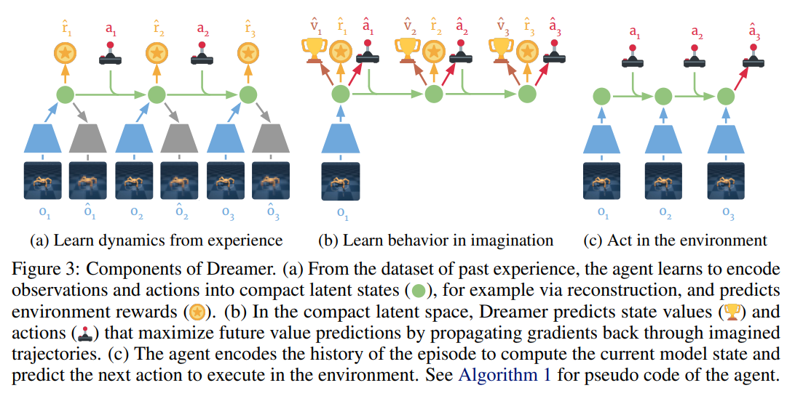
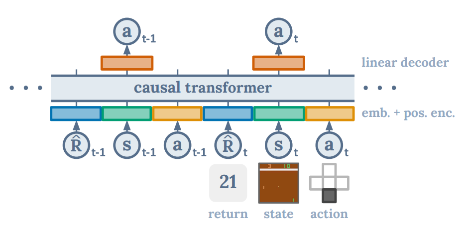
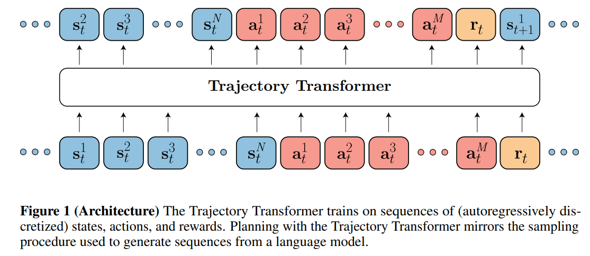

# RL Study

# Policy Gradient Methods

*reference: https://lilianweng.github.io/posts/2018-04-08-policy-gradient/*
*reference: my personal notes*

Policy gradient is one of the most used methods in RL, and its application could also be found elsewhere such as Variational Inference.

CIRL

* DDPG with IL initialization

* vision-only end to end RL
* Based on DDPG, which is a offline policy gradient method that can learn from continous action space, unlike DQN that requires discrete action space.
* For efficient exploration it quick-starts its learning with imitative learning.
* Considering integration with planning, CIRL optionally takes in a general direction command (follow, straight, turn right, turn left) for conditional action generation.
* initially trained via BC to first learn generally okay policy
* reward  The reward is a sum of five terms according to the
measurements from simulator: negatively weighted abnormal steer angles rs, positively
weighted speed rv in km/h, and negatively weighted collision damage rd, overlap with
the sidewalk rr, and overlap with the opposite lane ro.

# Dreamer: World Model based RL

## (Dreamer) Dream To Control: Learning Behaviors By Latent Imagination
ICLR (Mar) 2020
[[Paper]](https://arxiv.org/pdf/1912.01603.pdf) [[Code]](https://github.com/danijar/dreamer)

## DreamerV2

## DreamerV3

# Adopting the Sequence Modeling paradigm to Offline RL

While transformers and sequence modeling in general has taken various fields in Deep Learning (mostly NLP, some in CV) by storm, offline RL has not yet seen as extensive adoption or utilization of them. This survey explores recent methods in adopting the transformer architecture and/or sequence modeling for RL/LfD tasks.

## Decision Transformer: Reinforcement Learning via Sequence Modeling

[[Arxiv]](https://arxiv.org/pdf/2106.01345.pdf)

* Breaks free from prior paradigm in RL based on temporal difference learning by treating RL as a sequence modeling task

* Each playthrough sequence of (r,s,a) triplets are predicted by the network

* r, or $\hat{R}$, represents reward-to-go rather than expliity reward of given state, representing the total accumulated reward for the sequence. $R_{t} = R_{t-1} + r_{t}$

* Therefore, DT with the sequence modeling objective learns to how to act in order to achieved specific acumulated reward, which compared to traditional paradigm of achieveing highest possible reward is very different.

* After the modeling, best performance is achieved by the model by specifiying reward-to-go as something much higher or the highest possible achievable by the RL environment.

* State, Action, and Reward are processed through independent embedding layers

## Offline Reinforcement Learning as One Big Sequence Modeling Problem

[[Arxiv]](https://arxiv.org/pdf/2106.02039.pdf)[[Website]](https://trajectory-transformer.github.io/)

* Trajectory Transformer differentiates itself from DT (Decision Transformer) in mainly two ways: 1) A difference state, action space representation, and 2) use of planning (via beam search) while DT outputs exact action for given reward-to-go.

* While DT handles each state or action as single token with compressed representation, this work treats each dimension as separate token to capture more nuanced interaction between each dimension of state and action. 

* Trajectory Transformer also learns to predict each (s,a,r) in a sequential manner, while in DT its focus was only action with (r,s) moreless given

* Authors further explore how the architecture can be modified to support 3 varying tasks: 1) BC with similar setup as decision transformer, 2) Goal conditioned IL by including specific goal token either in beginning of sequence or at end with modfied attention mask (causal mask + special attention to goal), and 3) offline RL with reward to GO similar to decision transformer.

* According to desired task, authors use beam search as a way to plan: 1) for IL the most likely sequence has be chosen and hence this is standard beam search, 2) for RL and goal conditioning beam search has to utilize the (predicted) reward-to-go instead of the likelihood to sample/search the beams.

* Trajectory Transformer showed competitive performance to prior methods in RL, showing sometiems even better performance and overall better robustness to covariate shift.

## Reinforcement Learning from Passive Data via Latent Intentions
[[Paper]](https://arxiv.org/pdf/2304.04782.pdf)

* Issue: - utilizing passive data holds great potential for large-scale pretraining to learn general prior for downstream RL tasks, but passive data is has missing records for reward and action.
Proposed solution: Setup RL objective utilizing passive data - observations without reward or action labels
* estimate proxy action and reward to run offline RL on passive data by considering *intentions*.

# Off-policy RL

## Soft Actor-Critic: Off-Policy Maximum Entropy Deep Reinforcement Learning with a Stochastic Actor

[[ArXiv]](https://arxiv.org/pdf/1801.01290)
