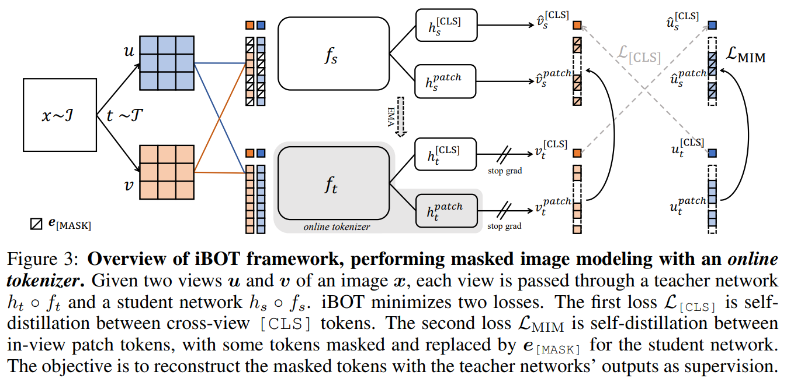
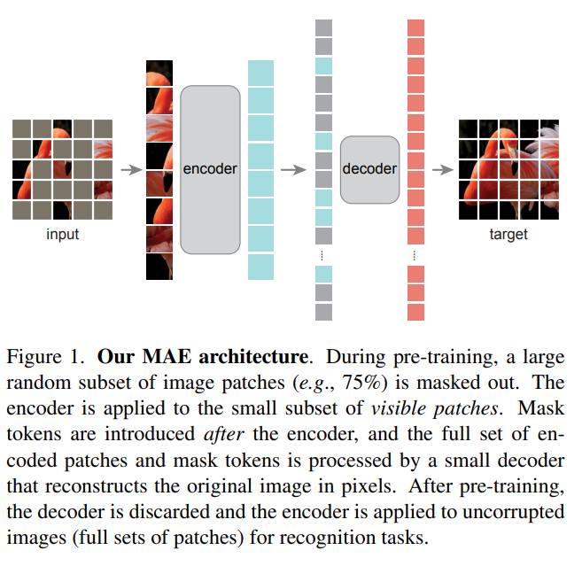
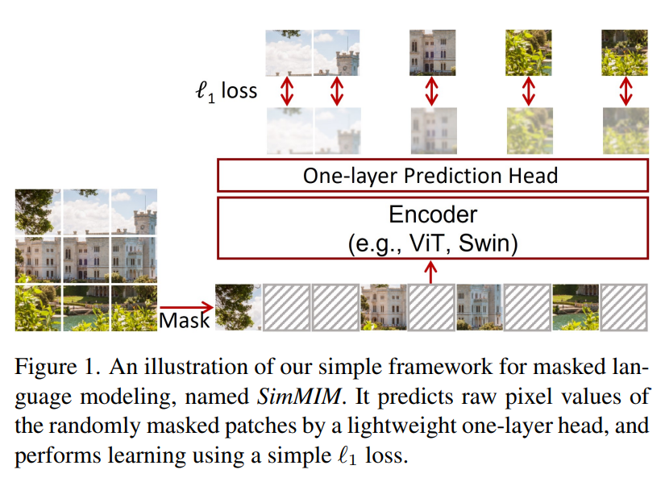
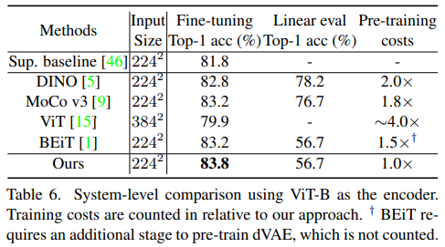
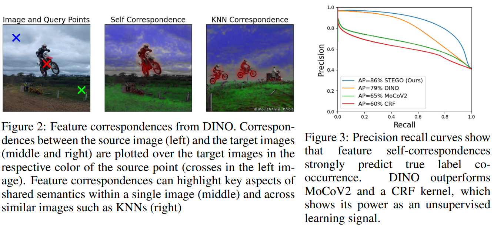
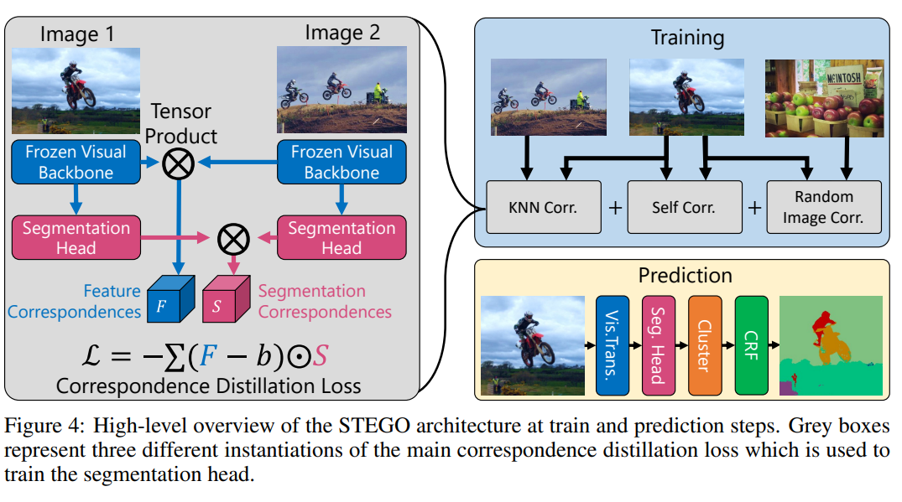

# Self Supervised Learning - way towards common sense knowledge

I enjoyed reading a comprehensive, well-written introduction to SSL avilable by meta <a href='https://ai.facebook.com/blog/self-supervised-learning-the-dark-matter-of-intelligence/'>here</a>. In this post, I summarize the reading in a more brief manner and survey more works on the field.

## Why SSL?

Self Supervised Learning, or SSL, refers to leraning methods that enable an algorithm (neural networks) to develop an understanding of the world from large, unlabeled data. Different from unsupervised learning, SSL in particular focuses on making sense of the data it is provided. A common approach to SSL is to artificially remove parts of the input data and teaching the network to fill in the missing information. This type of learning has shown to be very effective for Natural Language Processing, where large Language Models trained through autoregressive or autoencoding objective (which both learns to fill in the missing information but with different ways to occlude the ground truth) perform strongly on downstream tasks including but not limited to text classification, machine translation, and question answering.

The survey below highlights few notable papers from the fast and laregly growing field of self-supervised learning

# Contrastive Methods

## SimCLR

## SimCLRv2

As an incremental improvement paper, authors of SimCLRv2 noticed a few things about further scaling up SimCLR contrastive learning:
* 

# Momentum Encoding (non-contrastive positive matching) methods

## SWaV

## SimSiam

## BYOL

## DINO

## iBOT

[[ArXiv]](https://arxiv.org/abs/2111.07832) [[Github]](https://github.com/bytedance/ibot)

* iBOT combines DINO's image global view invariance with patch-level joint embedding prediction for a denser representation learning

* Two augmented views of the original images are than masked to create masked views

* The online tokenizer i.e. teacher network processes unmasked views of the image to get global view embedding from [CLS] token and local embedding for each patch

* The student network given masked patches as input instead has to learn matching representation embedding for global view [CLS] and the masked patches.

* The student therefore is trained via MIM objective but with the output in the embedding space, rather than outputting the exact RGB that is often subject to high frequence noise.

* Training batch size was 1024, implying this also requires large batch sizes for effective learning.

## DINOv2

* Greatly Expands on the oriinal work by scaling up data, finding improved learning method to complement the increased dataset, and implementation details to make hte overall training efficient to make learning at scale more feasible/efficient.

### Data Engine:
Inspired by NLP dataset curations, the authors focusing on building large uncurated dataset with quality similar to that of curated datsets such as ImageNet.

* Scraping: Web-crawling based on searching for  html tags used to scrape large amounts of images. Images then are filtered for NSFW, remove those restricted by domain, blurring faces, etc. --> 1.2B images
* Deduplication: near-duplicate images are removed following pipeline from a prior work.
* retrieval: Images from uncurated images similar to curated dataset are selected from the scarped & deduplicated pool of images for final dataset. Embeddings from ViT initally pre-trained on curated dataset is used to run K-means clustering on the uncurated dataset. For each representative query image from the curated dataset, the nearest cluster(s) is found and images are sampled to be added. Max N=4 samples are selected from large enough clusters, otherwise single sample is selected. --> final size of 142M.

### Updated Pre-training

The original Dino pipeline used momentum-encoder with whitening and sharpening of embedding channels with soft cluster assignment as the learning objective. At the same time it only have image-level supervision, albeit the transformer architecture showed it naturally attended to semantically distinct parts of the images.

DINOv2 combined DINO and iBOT:
1. Image-level objective: SWaV -> cluster assignment loss
2. Patch-leve objective: iBOT -> masked area embedding prediction task

Other 'less' important design improvements:
1. Separate heads for iBOT and DINO objective
2. Sinkhorn knopp algorithm used to center the teacher softmax
3. KoLeo regularizer to ensure minimum distance between set of vectors in the minibatch
4. Resolution increase by running larger 518x518 resolution training near the end of pretraining.

Other engineering improvements:
1. Flash Attention used, and architecture design i.e. embedding dim, num heads modified to best benefit from it
2. Sequene packing

## (I-JEPA) Self-Supervised Learning from Images with a Joint-Embedding Predictive Architecture
[[ArXiv]](https://arxiv.org/pdf/2301.08243)

* 

* 2.5x Faster training than iBOT

## V-JEPA: Revisiting Feature Prediction for Learning Visual Representations from Video

# Redundancy Reduction Methods

## Barlow Twins

* Loss function: Invariance + Redundancy Reduction

## VICReg

* Extending from Barlow Twins' redundancy reduction principle
* Loss: variance, invariance, covariance regularization
* Two notable advantages:
1. Robust to batch size - it can handle much smaller batch size
2. Multimodal - because each embedding output is treated separately, each side of the embedding may be geenrated from different domain e.g. text and image, image and sensor data, etc.

# Masked Image Modeling Methods

## Masked Autoencoders Are Scalable Vision Learners
[[Paper]](https://arxiv.org/pdf/2111.06377.pdf)

* mewn

## SimMIM: A Simple Framework for Masked Image Modeling
[[Paper]](https://arxiv.org/abs/2111.09886)

* Authors propose a simple Masked Image Modeling which involves three key components:
    1. Mask whole tokens with uniform random distribution
    2. Use L1, L2 basic regression loss to predict RGB pixels for masked areas
    3. Use linear projection layer (upscaling to original resolution linearly works well)
* Authors are able to demonstrate the features learned from this recipe works just as well or even better than prior SOTA, evaluate via finetuning for the ImageNet-1K benchmark.

* Additional observations include:
    1. **Token size 32 is the most robust to makeing ratio hyper parameter** - the key intuition behind this is that there exists ideal *avgDist* (distance of each pixel to nearest non-masked pixel) value and 32 token size helps achieve the ideal value with the widest range of masking ratios. i.e. for the completition task just the right amount of masking should occur to provide semantic cues for the network to recover the image instead of it being a complete hallucination task while the task itself doesn't become too easy.
    2. **Choice of regression loss does not matter** - authors tested l1, smooth l1, l2 which all perform similarly.
    3. **Direct color regression with linear prediction layer works better than other carefuly designed architectures** - authors find that simpling using a linear layer to upsample e.g. each feature pixel upsampled 32 x channelwise and reshapred to the correct resolution works as well or better than having complicated projection or decoder network. Although authors haven't tested SIMMIM on tasks other than classification, this may be indicating that the decoder(projection layer) design in contrastive learning does not transfer to masked image modeling. Authors also find that direct color regression works well in comparison to predicting cluster or discrete bin, hence learning that the problem does not have to be converted to that of classification.
    4. **Including reconsturction (predicting observed pixels) hinder performance** - authors hypothesize that the atsk of predict might be a  more promising representation learning approach than reconstruction.
    5. Authors were able to successfully use SIMMIM to scale model size up to 3B (Swin V2-G) and achieve SOTA accuracy. (At all model sizes for Swin pre-training with SIMIM shows better final accuracy after fine tuning)
    6. In general, masking the ideal masking ratio for MIM is higher at 60% on average compared to that used in LM at 15%.

## DINOv2

DinoV2 further extends the capabilities of the Dino SSL paradigm by focusing on scalinig up, and does so based on 3 core principles:
1. Data - the team curated much larger dataset of 141M images filtered from ~1B images crawled online
2. Technical improvements - the team focused on using additional regularization such as similarity search for more stable learning to combat against issues of scaling up dataset, while incorporating as many techincal improvements to traiing eifficienc such as flash attentino and mixed precision training.
3. Distillation for model size efficiency - self distillation is applied to to largest trained model to create a family of models for various applications.

* Question: how well does this transfer to other downstream tasks? e.g. object detection, semantic segmentation, etc..

# SSL for Autonomous Driving

## ALSO: 

## (STEGO) Unsupervised Semantic Segmentation by Distilling Feature Correspondences
[[ArXiv]](https://arxiv.org/pdf/2203.08414) [[Code]](https://github.com/mhamilton723/STEGO)

* Using self supervised features as surrogate to train semantic segmentation model in an unsupervised manner
* Self supervised features, including but not limited to DINO and DINOV2, has shown emergent capabilities of semantically coherent feature correspondences, where feature within each object (or its subpart/region) would hold high similarities between each other
* Therefore, STEGO trains a model to distill and amplify this property of SSL features

* Simply distilling featuers does not improve in segmentation ability
* STEGO therefore trains embedings that reflect feature corresponences - calculated feature correspondences between self, between images found via KNN, ranom image matches are used to supervised the added segmentation head
* at inference clustering + CRF is applied to this predicted embedding set to obtain masks
* Using purely correspondences of SSL features can mean the fetures do not map easily to semantic ontology, and therefore further exploration could be made to incorporate open vocab features e.g. CLIP or an efficient finetuning of models to downstream domain could be considered
