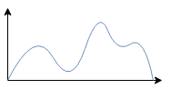

# Variational Inference

Variational Inference is a powerful method used to model the distribution of data, commonly found in generative modeling.

Consider modeling either marginal data distribution p(x) such as images or a conditional p(y|x) such as driving or manipulation i.e. plan action a given state s. In either case the true distribution can be very complex and multimodal:

Given such a distribution, it can be challenging to find a modle that robustly estimates this distribution directly. Variational Inference is one of the possible ways to model this, while doing so with a **relatively simple model**. The reason being it introduces new latent variable *z*, and by creating mappings to and from between x( or x,y) and z the mappings can be complex while the actual models p(x|z), p(y|x,z) can be quite simple.

## Variational Auto Encoder

We may start of the core concept of VI, or its application in generative modeling at least, with VAE. VAE has three components, namely:
1) prior p(z)
2) posterior p(z|x)
3) inference p(x|z)

<!-- 
## [GNM]

## [ViNT: A Foundation Model for Visual Navigation](https://arxiv.org/abs/2306.14846)
*Venue: arXiv* 
*Authors: Dhruv Shah†, Ajay Sridhar†, Nitish Dashora†,
Kyle Stachowicz, Kevin Black, Noriaki Hirose, Sergey Levine*  
 
 -->
