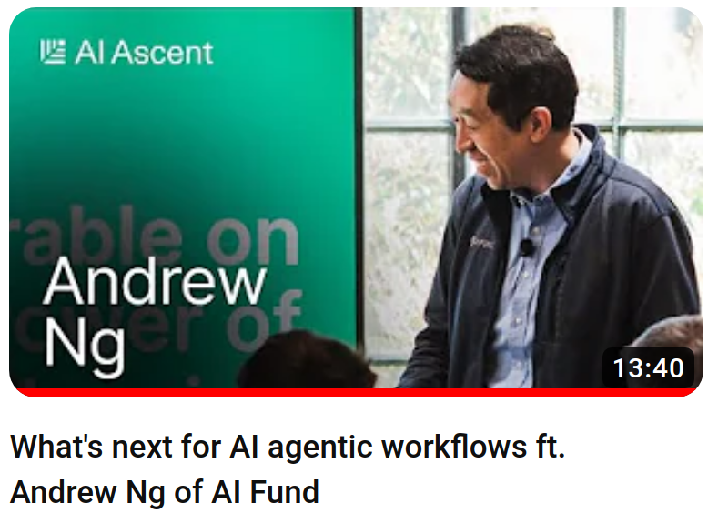

# Agentic Worflow
## *LLM -> Data Agent 워크플로우로*

<p align="center">

</p>

해당 블로그는 <a href='https://www.youtube.com/watch?v=sal78ACtGTc'>What's next for AI agentic workflows ft. Andrew Ng of AI Fund</a> 영상을 한국어로 풀어 작성하였습니다.

### Data Agents란?
최근에는 LLM 모델 자체의 개념을 넘어 해당 모델을 효율적으로 활용하기 위한 Agent란는 개념 또는 패러다임 변화를 겪고 있습니다.

1) Non-agentic workflow: 기본적으로 아무런 틀 또는 프레임워크 없이 LLM을 호출하여 작동합니다. ChatGPT와 같은 기본적인 채팅이라고 볼 수 있습니다.
2) Agentic workflow: 업무를 여러 세부 절차로 나누어 진행하듯이, 나눈 절차마다 LLM을 호출하여 체계적인 업무 수행을 합니다. 예시로 보고서 작성 시 모델에게 1) 목차 또는 키포인트 생성 2) 서론 작성 3) 초안 작성 4) 검토 5) 검토 반영하여 수정 등 나눠진 절차를 수행하도록 하는 것입니다. 모델에게 절차 생성 또한 프럼팅을 통하여 진행할 수 있습니다.

### Agent Design Pattern

Agent 워크플로우 활용 패턴으로 크게 다음 4가지가 있습니다:
1. Reflection - 이미 수행된 업무결과를 모델에게 평가를 진행시켜 검증 또는 수정을 진행합니다. QLoRA 등 학문에서 평가모델로 GPT-4를 사용하거나 산업에서 LLM 기반 평가 프레임워크가 있는 등 활용되고 있습니다.

```
(Worker Agent) - (Critic Agent)
```

2. Tool Use - OCR, 계산기 등 LLM 모델에게 도구/api 활용을 지원하여 정확도 및 업무범위를 늘립니다.

```
Q: 2+2? - (Agent calls calculated tool) - (tool: 4) - The answer is 4.
```

3. Planning - LLM에게 세부절차를 계획하게 한 뒤 해당 계획의 각 절차를 별도로 진행하여 최종 작업을 수행하는 것입니다. 해당 방식으로는 ReAct 프레임워크가 있습니다. Langchain, LLamaIndex 등 여러 패키지에서 지원하는 Agent도 해당 디자인 패턴을 주로 지원합니다.

```
Q: 2+2? - (Agent plans out to first use calculator) - (call tool to get 2+2=4) - (Agent is confident to give final answer) - The answer is 4.
```
예시에서 2번과의 차이는 능동적으로 도구활용 및 자가평가를 진행할 수 있습니다.

4. Multi-agent collaboration - 최근에 관심을 끌은 Cognition Labs 사의 Devin AI 처럼 machine-to-machine 또는 machine-to-human 상호작용에 대하여 최근 논의가 많아졌으며, AutoGen 등 여러 도구또한 개발되고 있습니다.

### Conclusion

테스크에 따라 필요한 디자인 패턴이 다를 수 있으며 RAG, LLM 등 해당 기술이 전체적으로 현재진행형임에 따라 여러가지 시행착오와 디자인 패턴의 정규화 등 아직 다양한 시도, 특히 실무자들과의 협업을 통한 여러시도가 많이 필요할 것으로 판단됩니다. 
