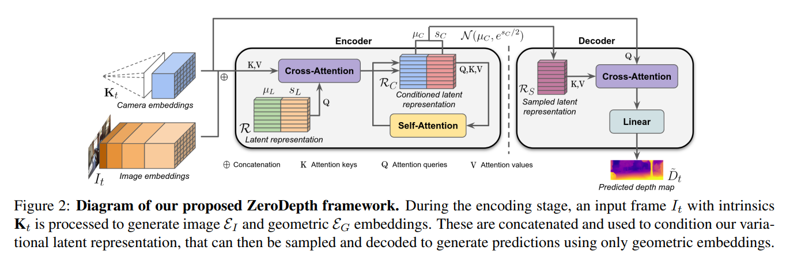
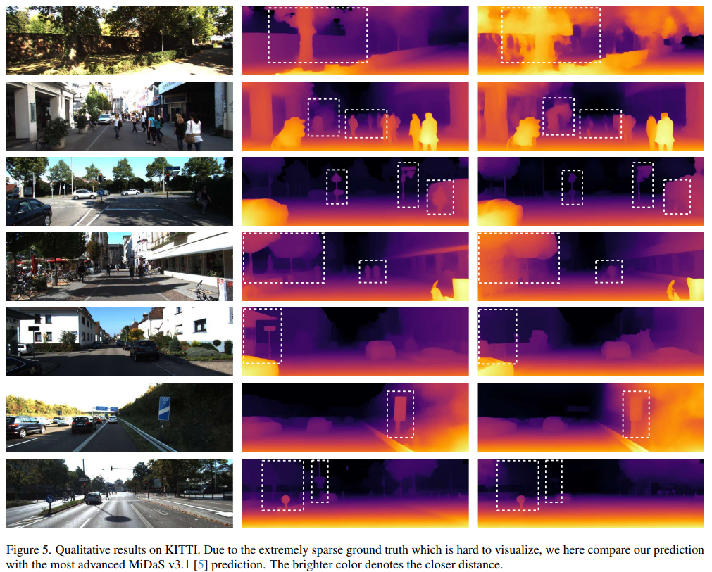
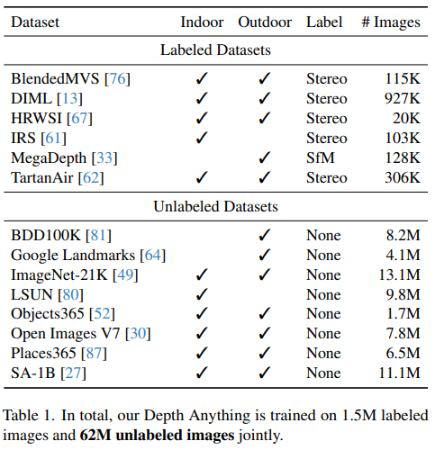
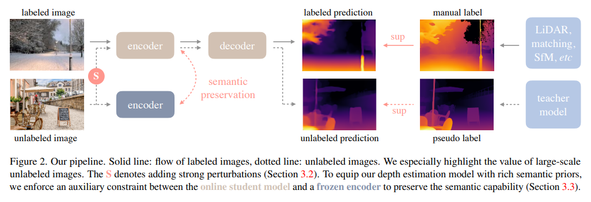

# Monocular Depth Estimation


## How non-metric depths are typically scaled to metric depth


# Towards Zero-Shot Scale-Aware Monocular Depth Estimation
[[ArXiv]](https://arxiv.org/pdf/2306.17253v1.pdf)

<p align="center">

</p>

* Adopted PerceiverIO architecture, an efficient transformer architecture for depth estimation


# Depth Anything
[[ArXiv]](https://arxiv.org/pdf/2401.10891.pdf)

<p align="center">

</p>


* Focuses on learning with scale
```
1. Use both label/unlabeled images for Monocular Depth Estimation
2. Authors propose using student-teacher framework where teacher trained on labeled data generated pseudo-labels, which the student network uses to learn along with the labelled dataset
3. All datasets use the normalized (0,1) disparity space - to achieve this the data is normalized and the affine invariant MSE is used, where the gt, pred are always scaled to exact (0,1) space.
4. Sky is preprocessed with a pretraiend segmentation model with disparity label 0 (farthest).
5. ViT encoder initialized with DINOv2 weights for improved semantic prior and training.

```

<p align="center">

</p>

* not metric-level, involves fine-tuning to the final downstream task/dataset
* Reaches SOTA on relative depth, as well as on finetuned metric-level depth

<p align="center">

</p>

Some notes:
```
1. Following prior work, student is re-initialized instead of using teacher teachers weight
2. Simply adding pseudo labels for an already well-performing model does not yield much improvement (i.e. student will also just make the same mistakes as the teacher), and hence to make better use of them a much more challening optimization is presented to the student by heavily perturbing the image. Specifically, color jittering, Gaussian noise, and Cutmix is utilized. (This part reminds of learning stronger student via noisy learning in SimCLRv2).
3. At the encoder a (margin) feature alignment loss with DINOv2 is applied to provide learning of semantic prior, though given that similar semantics can still mean different depth e.g. car front and rear, the loss is only applied to marginally align the features and not exhaustively.
```