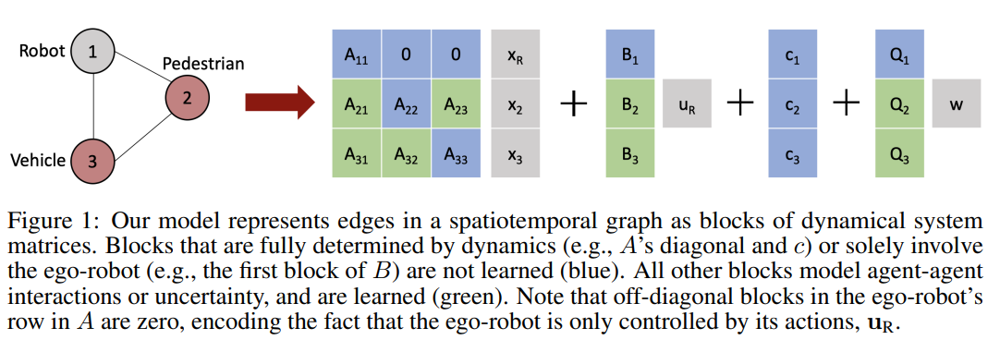

# Trajectory Forecasting: estimating where every(one)(thing) will go next

Trajectory or motion forecasting is the task of estimating the location (and the kinematic state) of objects and people of interset for a certain time window in the future. Its common applications revolve around indoor navigation and autonomous driving for robotics.

The [blog](https://ai.stanford.edu/blog/trajectory-forecasting/) written by Boris Ivanoic explains the history and motivation of different ideas in trajectory forecasting quite well. To summarize:
* Early work on ontological methods used heuristics and dynamics models to explicitly define behavior
* Fairly recent adundance of data now allows for data-driven phenomenological methods to outperform the ontological methods
* Data driven methods can output trajectories deterministically or probabilistically (output a distribution)

The rest of this post surveys recent approaches on the second approach - deep learning based trajectory forecasting.

## Social LSTM: Human Trajectory Prediction in Crowded Spaces
[[Paper]](https://cvgl.stanford.edu/papers/CVPR16_Social_LSTM.pdf)

* Human motion forecasting with LSTMs
* Besides encoding dynamics per invidual with motion history and LSTM, the social pooling module is introduced to aggregate neighboring hidden states
* Future trajectory waypoints predicted deterministically 

## Multimodal Deep Generative Models for Trajectory Prediction: A Conditional Variational Autoencoder Approach
[[Arxiv]](https://arxiv.org/pdf/2008.03880.pdf)

* Utilizes Conditional Variational Autoencoder (CVAE), a latent variable generative model to predict the possible distribution of future trajectories
* Discrete distribution chosen for latent variable z to allow for explicit evaluation as well as efficiency in training. The intuitive idea is that each value should represent a portion of behavior modes.

## MATS: An Interpretable Trajectory Forecasting Representation
[[ArXiv]](https://arxiv.org/abs/2009.07517)

* Making trajectory prediction model-based and interpretable by integrating dynamics systems to prediction networks
* "Our approach leverages successful ideas from probabilistic trajectory forecasting works to leran dynamical system representations that are well-sutided in the planning and control literature"

## (HAICU) Heterogeneous-Agent Trajectory Forecasting Incorporating Class Uncertainty
[[ArXiv]](https://arxiv.org/pdf/2104.12446.pdf)

* Developed on top of trajectron++ to forecast trajectories with information of semantic uncertainty
* Motivation: if the predicted semantic class from the perception module is wrong, then trajectory forecasting accepting the incorrect class as is will struggle to predict correct trajectory as semantics often correlate to motion e.g. people and cars form different dynamic systems.
* Proposed solution: 1) add semantic probability of perception as input besides the actual prediction tracklets 2) tracklets are connected to also make the model more robust to incorrect tracklet formation (i.e. after two objects come close they may be assigned wrong ids and lead to 'swapping' of tracklets)

## Learning Lane Graph Representations for Motion Forecasting

* Represents a scene with graph for input encoding and motion forecasting
* Agent trajectories are separately processed by ActorNet, processing sequences via 1D CNN + FPN
* Graph Convolutional Network (GCN) used to extract road features - HD map used to construct lane graphs processed by GCN
* Fusion Net aggregates information between lane features and agent history and models lane-lane, agent-lane, agent-agent interaction

## VectorNet: Encoding HD Maps and Agent Dynamics from Vectorized Representation
[[ArXiv]](https://arxiv.org/pdf/2005.04259.pdf)

* Represents driving scene with vectors for efficient and intuitive reprsentation
* Each type of input (map, road agent) processed to create splines for feature extraction
* Transformers based VectorNet first encodes each spline individually (local transformer) to extract information independently than processes their interaction with a global transformer that connects all nodes
* Network's performance demonstrated with motion forecasting

## Rules of the Road: Predicting Driving Behavior with a Convolutional Model of Semantic Interactions

* CNN processing rasterized HD map for trajectory forecasting
* Input representation: crosswalk, road lanes, traffic light, stop & yield lanes passed as rasterized grid
* Encoding entities: ego & other vehicle trajectories are passed in as coordinates with kinematic (velocity, acceleration), but also with uncertainty on location as covariance matrices
* Main drawback: Using a rasterized map representation loses its original inherence graph structure of the road. Authors do acknowledge this point, and actually mention that it is left "as a modeling challenge to learn valid road rules like legal traffic direction, and valid paths through a junction" (for the neural network).
* Architecture: Encoder Decoder CNN mainly comprising 2D convs but also 3D convolutions as a temporal processing layer. Optional RNN decoder outputs trajectory in recurrent fashion while FC layer may be used for single-step predictions instead.
* Output: The model is trained as a Conditional VAE - 

## MultiPath++: Efficient Information Fusion and Trajectory Aggregation for Behavior Prediction
[[ArXiv]](https://arxiv.org/abs/2111.14973)

## TNT: Target-driveN Trajectory Prediction
[[ArXiv]](https://arxiv.org/pdf/2008.08294.pdf)

## DenseTNT: End-to-end Trajectory Prediction from Dense Goal Sets
[[ArXiv]](https://arxiv.org/abs/2108.09640)

## Multimodal Trajectory Prediction via Topological Invariance for Navigation at Uncontrolled Intersections

## (MTR) Motion Transformer with Global Intention Localization and Local Movement Refinement
[[Paper]](https://arxiv.org/abs/2209.13508)

* Proposes transformer based enocoder-decoder architecture for trajectory forecasting
* Novel static and dynamic motion query pair passed in to decoder allows the model to decouple intent and local motion prediction separately and thus allows more accurate multi-modal forecasting
* Showed clear improvement over prior SOTA such as MutliPath++ on WOMD benchmark for both marginal and joint trajectory prediction
* Does involve quite a bit of engineering/rule-based post processing such as the joint probability processing for joint motion prediction. 

## DenseTNT: End-to-end Trajectory Prediction from Dense Goal Sets

## PRECOG: PREdiction Conditioned On Goals in Visual Multi-Agent Settings
[[Paper]](https://arxiv.org/pdf/1905.01296.pdf)

## Wayformer: Motion Forecasting via Simple & Efficient Attention Networks
[[Arxiv]](https://arxiv.org/pdf/2207.05844.pdf)

## StopNet

devloping motion forecasting method that scales to large number of road users while maintaing real-time inference speed.
StopNet conducts real-time motion forecastng, while as its byproduct produces occupancy output.

prior work: 1) rasterized input uses expensively large CNN, and involves rendering, 2) point based methods is much sparse and efficient( as well as accurate), but it requires re-encoding input to ego agent's frame for each agent.

StopNet: 1) uses pointpillars style encoder to directly process sparse points as input 2) produces occupancy grids as its byproduct, which can be fed as input to planner almost instantaneously as constraints

can't you scale the inputs in prior work to some global, canonical frame? --> this is what stopnet's main design stems from --> "a whole-scene sparse input representation and model"

architecture: BEV voxelization --> point-net encoder per voxel --> CNN encoder --> trajectory/occ decoder
traj decoder: adopted multipath. uses set of pre-defined trajectory anchors defined from clustering data. predicts delta offset per anchor trajectory (technically, any decoder may apply here as long as it can utilize 2D BEV feature map as input) deltas are predicted as a gaussian mixture model. Per agent it uses corresponding pixel feature extracted from the feature map as input.
occ decoder: CNN applied to output per timestep, per class binary occupancy grid.

Besides applying corresponding loss to the two decoders, a consistency loss is applied by using output from trajectory prediction to gnerate occupancy grid.

## JFP: Joint Future Prediction with Interactive Multi-Agent Modeling for Autonomous Driving
[[Arxiv]](https://arxiv.org/abs/2212.08710)

* Most trajectory forecasting only looks at marginal predictions i.e. agent trajectories are evaluted/predicted independently. This overall ignores the joint nature of the trajectories.

## MotionDiffuser: Controllable Multi-Agent Motion Prediction using Diffusion
[[Paper]](https://arxiv.org/pdf/2306.03083.pdf)

* Uses Diffusion to build controllable generative model for trajectory generation & forecasting

## Multimodal Trajectory Prediction via Topological Invariance for Navigation at Uncontrolled Intersections
[[ArXiv]](https://arxiv.org/pdf/2011.03894.pdf)

## MotionLM: Multi-Agent Motion Forecasting as Language Modeling
[[ArXiv]](https://arxiv.org/pdf/2309.16534.pdf)

* Following Language Modeling Paradigm by treating set of motiion primitives i.e set of discretized motion tokens to treat motion forecasting as sequennce/language modeling task
* Natively supported by purely attention-based transformer architecture with the proposed framework

* 

## Pedestrian Crossing Action Recognition and Trajectory Prediction with 3D Human Keypoints
[[ArXiv]](https://arxiv.org/pdf/2306.01075.pdf)

* Specifically aimed towards pedestrians' motion forecasting
* Instead of purely conducting trajectory forecasting, learns a more robust internal representation by training for both action recognition (crossing) and trajectory forecasting.
* Model involves keypoint encoder, road context encoder, target track encoder, a global attention module, and 5 decoder ouput
* Decoder heads are 2 main output heads (cross action recognition, trajectory forecasting), and 3 auxilliary heads (keypoint jigsaw matching, keypoints prediction, keypoints contrastive model)
* Takes perception output as input e.g. road graph, detected 3D bounding boxes, pedestrian pose keypoints
* By focusing on learning representation embeddings of 3D keypoints as its representation, the model learns deeper semantically contextual information useful for both activity recognition i.e. crossing, and overall trajectory forecasting.

# Miscellaneous

## Gaussian Mixture Model Predictions
