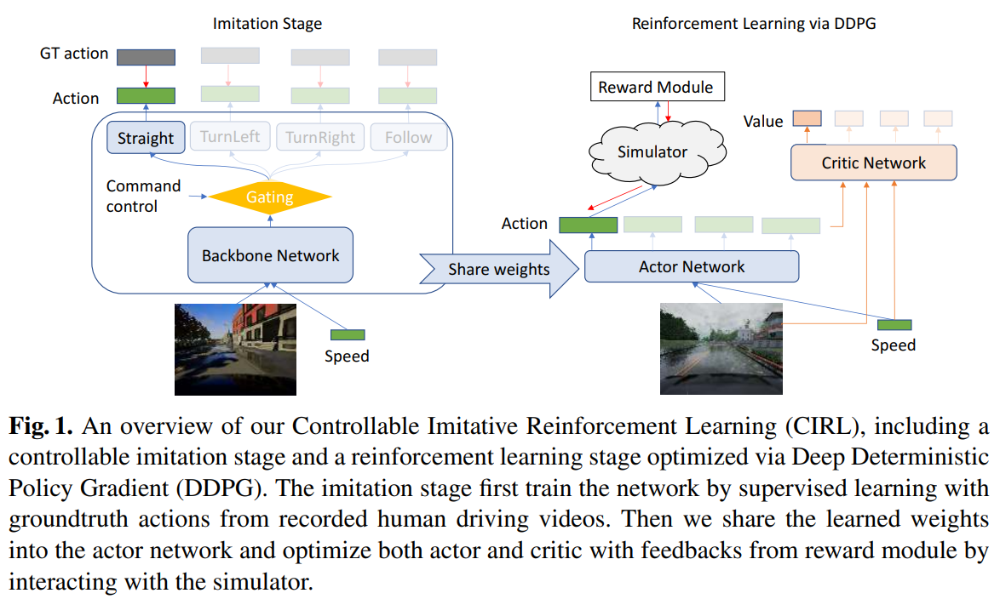

### *None of the discussed/presented works in this page are work of my own, for details check links for each paper.*

# Inverse RL: Recovering Reward Function from Human Demonstrations

## LEARCH

* 

<!-- 

 -->
