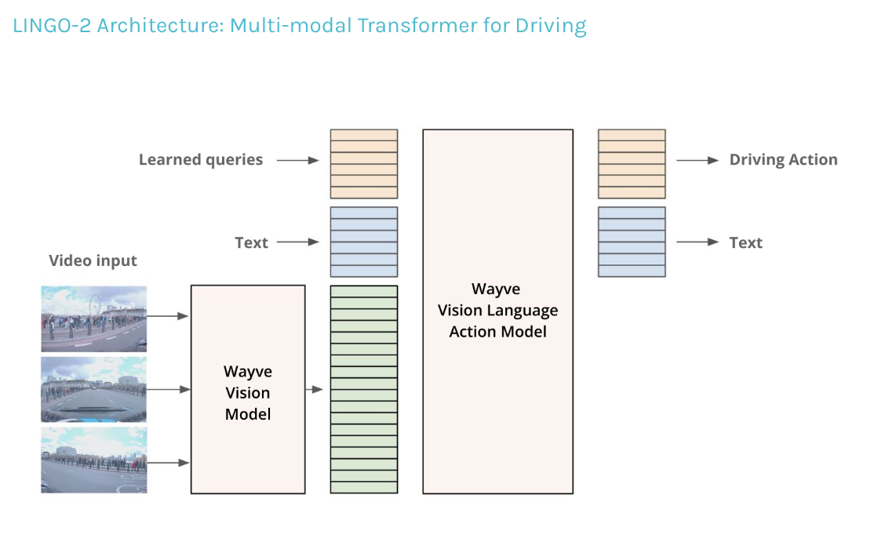

# LLM, VLM, VLA, and Robotics

This blog explores relevant works regarding:
* Use of Large Language Models in Robotics
* Use of Vision-Language Models in Robotics
* Use of Vision-Language-Action Models in Robotics

## (LLAVA 1.5) Improved Baselines with Visual Instruction Tuning

* Authors haev shown LLAVA training can be done in a day with 8xA100 cluster, which still costs some 2000+ USD but is still much more efficient and affordable compared to other instruction tuning methods.

## InstructBLIP: Towards General-Purpose Vision-Language Models with Instruction Tuning

[ArXiv](https://arxiv.org/pdf/2305.06500)

## Fine-Tuning Large Vision-Language Models as Decision-Making Agents via Reinforcement Learning

## LINGO-2

Vision Language Action Model (VLAM) from Wayyve with impressive capabilities of alining natural-language based reasoning with the actual vehicle control.

https://wayve.ai/thinking/lingo-2-driving-with-language/

https://www.youtube.com/watch?v=mU3TFv9Zi4I

LINGO-2 shows reasoning with consistent language - specifying certain variation of possible dialogue such as "keeping to the speed limit", "keeping the same speed, the road is clear", etc. I believe the model was likely trained with a set format such that the generated language is always coherent, and does not randomly run off to generate superfluous reasons, talk for too long, etc.

Most notably, LINGO-1 only provided text output with retrospective commentary. In contrast, LINGO-2 outputs both text and driving action and allows real-time interaction along with reasoning and visual QA. Furthermore, LINGO-2 is trained with textual input, and can therefore not only answer any questions from the user but also handle instructions on planning.

LINGO-2 still has limitations, however. For instance, there needs to be a more jusitifable quantification of the alignment between its text output i.e. reasoning and the predicted trajectory i.e. driving action. It looks like it also needs some closed-loop, real-life testing to validate whether it has reliable driving capabilities.

# InternVL: Advancing Open-Source Vision-Language Models
[Project Page](https://internvl.github.io/blog/2024-12-05-InternVL-2.5/)

The InternVL recipe is quite huge and complex. I distilled it down into the following key points:

* Large vision encoders improves MLLM training data efficiency and performance: InternVL2.5-78B uses a 6B vision encoder with dynamic tiling, and the model pretrained on large image-text data, to reduce training cost of the MLLM itself.

* "Data quality matters.: Upgrading InternVL from 2.0 to 2.5 doubled the dataset size, but strict filtering greatly improved quality. For example, we carefully excluded the training data with anomalous samples (e.g., repetitive patterns), achieving substantial improvements in Chain-of-Thought (CoT) reasoning tasks such as MMMU and complex challenges like the OlympiadBench." --> *once trained on filtered samples, methods such as CoT reasoning can be applied to improve performance (that originally did not work well on MLLMs)*

* "Test-time scaling is beneficial for difficult multimodal QA: For challenging tasks such as MMMU, the InternVL2.5-78B with CoT reaches 70%, which is 4 points higher than the direct response. Subsequently, we have successfully verified that CoT can be further combined with majority voting and bring additional improvements.

InternVL, like other MLLMs, is a large, complex, engineering project with extraordinary effort from the team behind it. Putting the details of training and architecture aside, it seems clear that the trend is moving past scaling to data quality and test-time strategies.