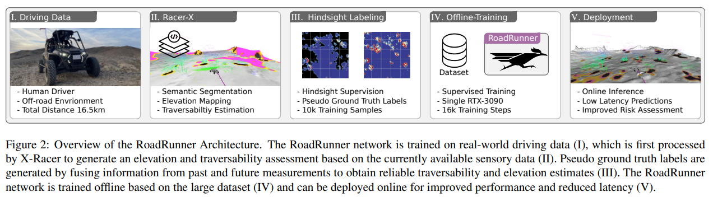

# Offroad Autonomy
*Last update date: 2023-10-25*

Offroad Autonomy is a relatively old subject, with its roots going back to the DARPA grand challenge. In this blog I highlight some works that I found most relevant to this topic, as well as some of my own contributions made through the SARA and RACER project.

<i>I am one of the authors for papers marked with *.</i>

## Multi-modal Semantic Segmentation

## BEV Perception for Offroad Autonomy

### BEVNet

### TerrainNet

### V-Strong

### RoadRunner - Learning Traversability Estimation for Autonomous Off-road Driving

[[Paper]](https://arxiv.org/pdf/2402.19341)

## Traversability Analysis

The task of Terrain Traversability Analysis, or TTA, aims to find ways to reliably estimate the traversability of terrain i.e. the level of difficult a said vehicle would face if it were to travel over the particular terrain of interest. 

In particular, for complex tasks such as driving there may be a skill set the robot may learn from human demonstrations and later apply as necessary to complete its tasks. There lies a fundamental challenge in aligning human preferences to the driving task at hand, all while understanding basic notion of traversability.

Overall, the trend highlights LfD and SSL as two promising directions for learning scalable, robust TTA.

## TTA by Robotics Lab @ Zurich (Legged Robotics)
Original documentation and code is available [here](https://github.com/leggedrobotics/traversability_estimation)
The TTA module in the legged autonomous system provided here focuses on the geometric aspect of TTA. In particular, the module uses 4 filters for traversability estimation:
1. Surface Normals Filter
2. Slope Filter
3. Roughness Filter
4. Step Filter

## Learning Agile Locomotion on Risky Terrains 
[[ArXiv]](https://arxiv.org/abs/2311.10484)

Overall note; using isaac sim for sim2real transfer, various improvemetns are made over prior work to train end-toend RL agent using navigation-based learning objective.

Many prior works on learning methods for locomotion typically focus on velocity tracking i.e. make the robot keep going at desired velocity, which to do so learns to move. However, the desired velocity for risky terrain can greatly and rapidly vary, and hence a different learning objective is required. Therefore, the authros use the navigation problem formulation.

1) navigation task for RL
2) reward shaping to get model to learn diverse, safe behavior
3) genearlist to specialist policies, a two-stage training policy to allow faster and more efficient learning
4) sim-to-real transfer

genearlist  to specialist policies, first learn general motions, then focus on terrain-specific nuances.

Perpception is granted for this task, though integration as future work remains.

Locomotion as navigation --> reward function provides high reward when goal condition met i.e. within x distance to goal, 0 otherwise --> a sparse reward.

**write reward function here**

Exploration strategy for on-line RL: 1) cirriculum training starts policy training on easier environments, then slowly introduces more challening environments to possible set of environments, while the demoting criteria is relatively generous to prevent the difficult gap from agetn learning anything in the new env.
2) intrinsic curiosity rewrad is applied to encourage novel behavior.
3) symmetry based data augmentation: due to symmetry, a single (s,a) pair can be inverted front/back and right/left to be x4 the dataset size.

Genearlist-specialist training: sparse reward mean training difficult chalelning stepping stones like behavior directly is too ineifficient. Hence simple-hard environments are introduced while the generalist model trained on more general, simpler environment serves as generatlist model finetuned to other specific environments/domains.

Having a truly generalist policy that works on various terrains within one policy remains a challenge/limitation. some reward shaping is still used to show better performance on each domain.

*Policy output: target joint states*

## Learning autonomous driving
This section explores imitation learning for autonomous driving, including both on-road and off-road scenarios as there are some overlaps between the two.

