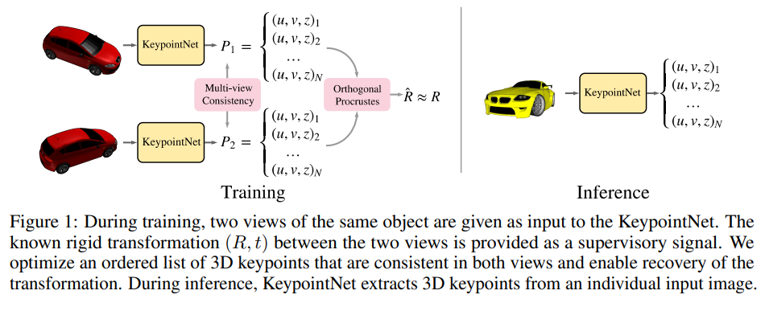
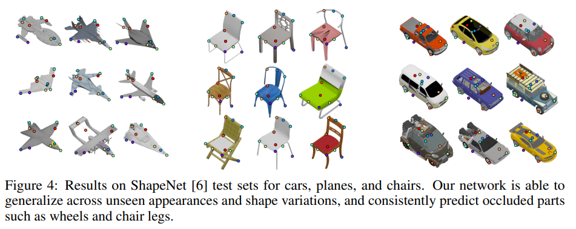
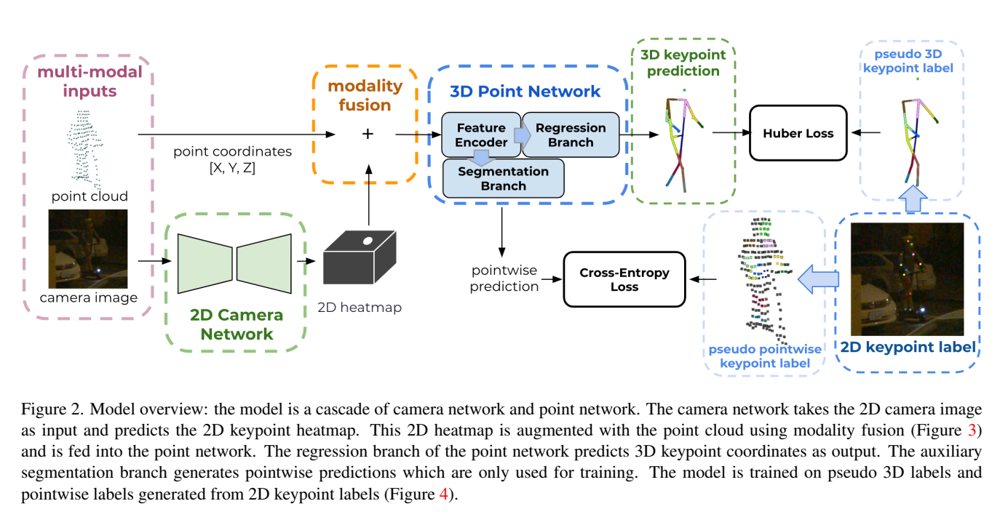
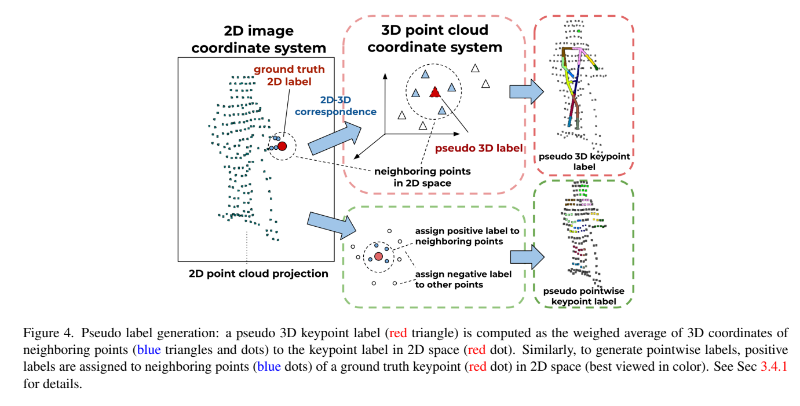
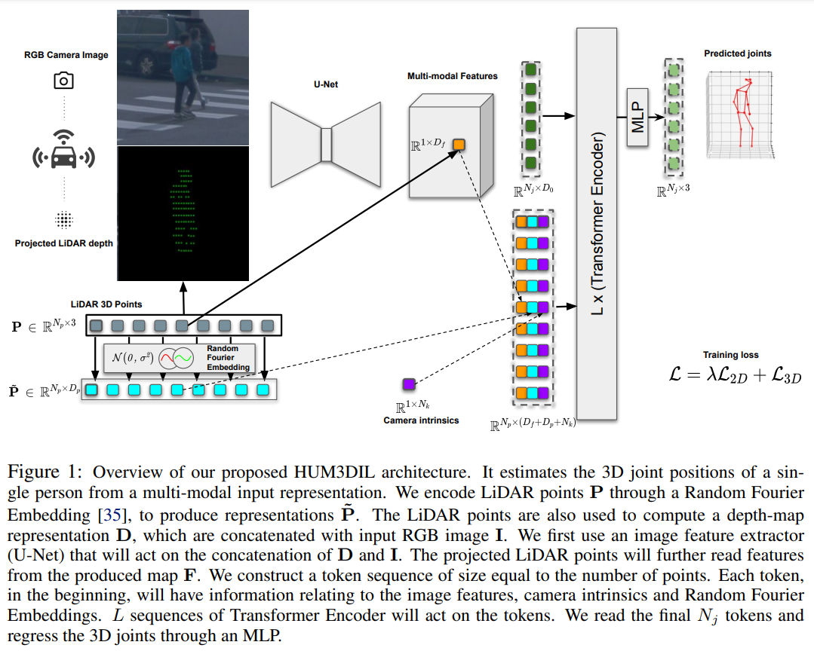

# Pose Estimation

* Estimating object poses given sensor/perception input
* Typically focuses on 6D estimation from RGBD or LiDAR for objects, and 2D/3D keypoint estimation for humans

## Discovery of Latent 3D Keypoints via End-to-end Geometric Reasoning
[[ArXiv]](https://arxiv.org/abs/1807.03146)

* Emerging keypoint representation from learning to regress pose
* End-to-end network architecture has two modules: keypoints proposal network that produces N keypoints from input image, relative pose estimator that uses the keypoints to estimate delta 6 DoF pose between multiple views
* Given the architecture design and learning objective the network naturally lears to attend to semantically meaningful area for keypoint/context e.g. wheels, corners

## Multi-modal 3D Human Pose Estimation with 2D Weak Supervision in Autonomous Driving
[[ArXiv]](https://arxiv.org/pdf/2112.12141.pdf)

* 3D human pose keypoints estimation network
* Losses in 2D via weak-supervision and multi-task learning help the network learn a more robust geometric understanding of poses, while reducing labeling cost by not using any explicit 3D annotations
* Input RGB processed by camera network to produce 2D heatmaps that helps densify the sprase LiDAR input for better context
* Input pointcloud, fused with 2D information via modality fusion, is processed by 3D point NEtwork to regress 3D keypoints
* Fusion is achieved via point painting, where LiDAR pionts projected to image coordinates is used to index image features to concatenate each point with. To use larger receptive field, features are intepolated w.r.t heatmap intensities estimated as binary heatmap from camera features.
* Authors use voxelnet for 3D points processing

* 2D keypoint labels are used in 2 ways: 1) global regression - 2) pointwise label - points in 3D within certain raidus of the 2D keypoint labels when projected are labeled as positives to train a pointwise classification objective to allow for more efficient learning

## HUM3DIL: Semi-supervised Multi-modal 3D Human Pose Estimation for Autonomous Driving
[[ArXiv]](https://arxiv.org/pdf/2212.07729.pdf)

* Similar to earlier 2D-3D pose estimation work, HUM3DIL (HUMan 3D Image and Lidar) uses multimodal input to regress 3D keypoints for human pose estimation
* Architectural improvements:
    1. camera-lidar fusion uses 
        1) LiDAR projected to image as sparse depth image to create RGB'D' input
        2) Features produced by UNet is queried via back-projection to project them onto LiDAR as image features. The map is used from query from points via linear interpolation. i.e. point painting
    2. LiDAR is augmented with image feaures and Random Fourier Embedding w.r.t its cartesian coordinates.
    3. The main encoder-decoder (pose estiamtion network) is transformer-based
* Model is given sensor data and predicted/gt bounding boxes as input to output 3D keypoints per human.
* Training losses include 3D keypiont losses on where label is available, and 2D keypoint losses where predicted 3D keypoints are projected to 2D for comparison against teh 2D labels. (*This is mainly achievable via relase of WOD pose estiamtion dataset that has mostly 2 annotations and some 3D annotation*)

* Limitations include model only accepting individual crops as iput, hence cannot process multiple people all at once, and suffering performance decay due to LiDAR dependence and consequently heavy occlusion.