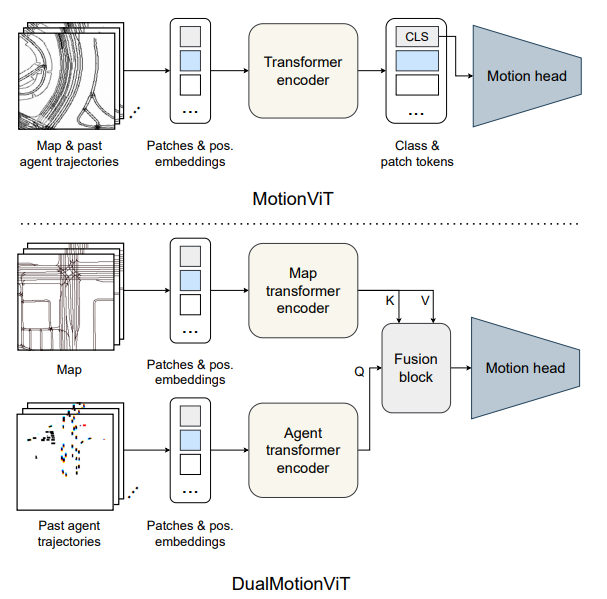
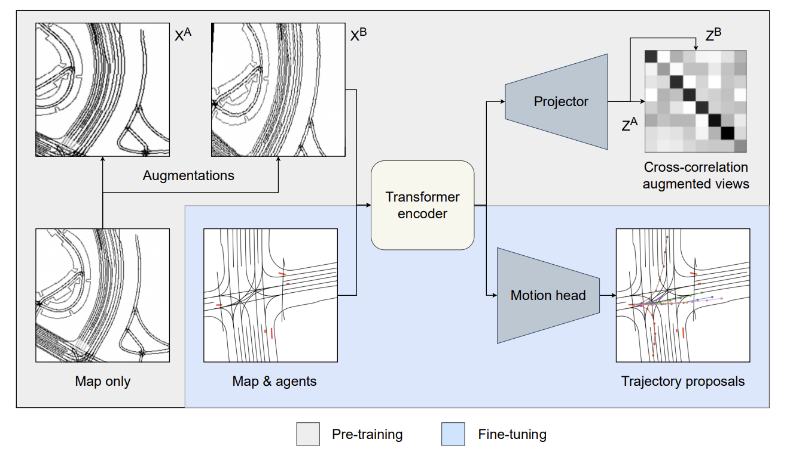
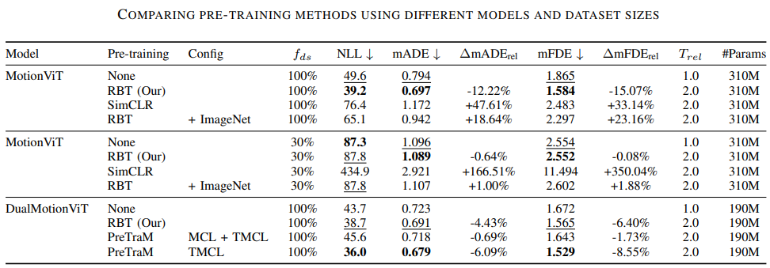
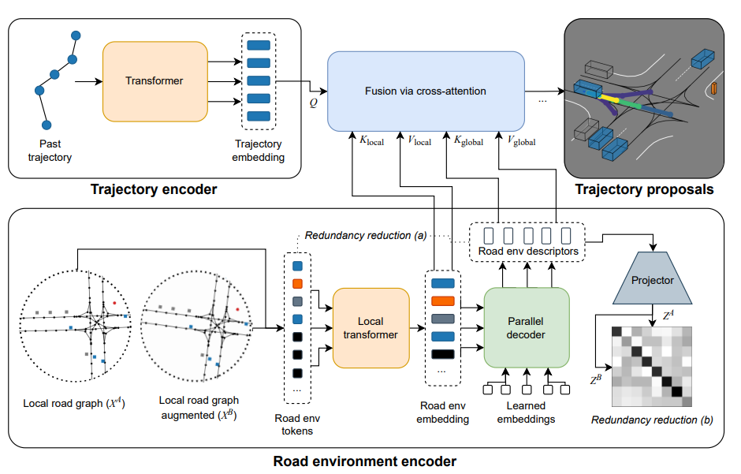

# Pre-training for Robotics

## Road Barlow Twins: Redundancy Reduction for Motion Prediction
[[ArXiv]](https://openreview.net/pdf?id=HI12AzV3ZA) [[Code]](https://github.com/KIT-MRT/road-barlow-twins)

Motion forecasting is a crucial task in autonomous driving as it allows the vehicle to plan maneuvers around other vehicles and avoid collision by anticipating their future trajectories. In this work, the authors show that they can use Barlow Twins as an effective self-supervised learning to learn representations for fine-tuning for trajectory forecasting with a positive transfer (on average 10+% accuracy improvements).

* Authors propose two types of motion prediction networks derived from MotionCNN
* Features extracted from HD map via ViT (ViT-S/16, ViT-L/16)
* In MotionVit, the map and past agent trajectories are passed into single transformer encoder, and its class token output is procssed by a MLP decoder to predict candidate trajectories
* For DualMotionViT, the map and trajectories are processed separately. For O(n) complexity, only the class token from agent transformer encoder is passed to the fusion block for cross attention. Like MotionVit, the class token from the fusion block is passed to the motion head.

* Use of SSL(Barlow Twins) to learn robust representation for HD maps
* Authors pre-train the encoder models on map-only data with the redundancy reduction objective
* Pre-trained model thus extracts self-supervised features from HD-maps with augmentation invariance
* Given the nature of HD maps some augmentations can be removed to match the SSL objective better to the HD map input: gaussian blur and flip is removed, and rotation is reduced. This is because in the downstream task different orientations should lead to different behavior and hence their features being similar would be not so beneficial.

* As shown in experiments Road Barlow Twins "improves the mADE score by 12% and the mFDE score by 15%" over the baseline without any pretrianing
* RBT (Road Barlow Twins) also outperform SimCLR, potentially showing that non-contrastive learning is the better choice in this problem as contrastive sets a lot of false negatives (i.e. forcing model to learn dissimilar embeddings for similar maps)
* Pre-training with imagenet also does not bring much benefit, showing the importance of using the right data for the downstream task.
* Using agent trajectory information still outperforms the proposed method, indicating that either agent trajectories should be considered for better performance improvements from pre-training and/or more room for improvement in map-only pre-training such as RBT.
* Trajectory-Map Contrastive Learning (TMCL) still performs the best, indiciating that fusing trajectory information is crucial for the task of trajectory forecasting.
* Lastly, DualMotionViT overall performs better than MotionViT, implying that distingiushing features for map perception and agrent trajectories is crucial to improving performance further.

## RedMotion: Motion Prediction Via Redundancy Reduction
[[ArXiv]](https://arxiv.org/pdf/2306.10840.pdf) [[Code]](https://github.com/KIT-MRT/red-motion#redmotion-motion-prediction-via-redundancy-reduction-)

* Follow-up paper to Road Barlow Twins
* Further exploits capabilities of transformer model by considering road environment tokens instead of the rasterized HD map
* Two types of redundancy reduction explored: 1) transformer decoder output on road environment tokens that reduces input to a fixed size embedding and 2) reduction between embeddings generated from augmented view
* <b>Redundancy Reduction between token sets</b>: global cross attention applied between RED(Road Environment Descriptor i.e. agent and lane features) tokens and road environment tokens. (this steps tries to compress the features to be reprsented by a set of smaller, fixed size set of tokens for efficiency and consistency)

* <b>Redundancy Reduction between embeddings</b>: RED tokens are projected to final embedding with MLP which is then trained with the Barlow Twins objective. This encourages the RED tokens to each represent different aspect of the environment while the token sets themsevles learn to represent similar features for similar local road graphs.

* The trajectory encoder finally fuses information altogether via cross-attention similar to Wayformer and generates trajectory proposals. This part of model is only trained via supervision.
* RedMotion, with or without past trajectory information, surpasses several baselines in generating accurate trajectory forecasts (evaluted on minADE, minFDE).