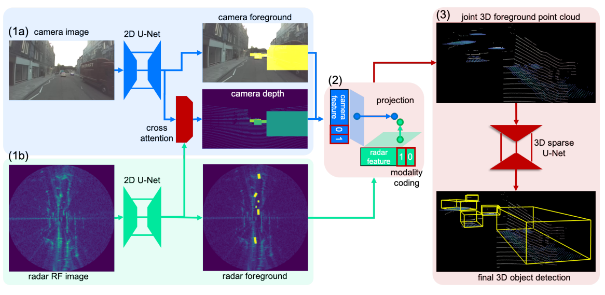
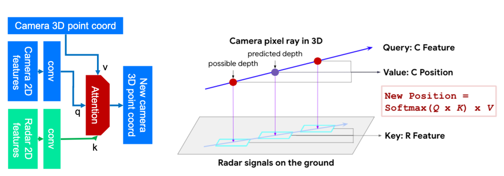
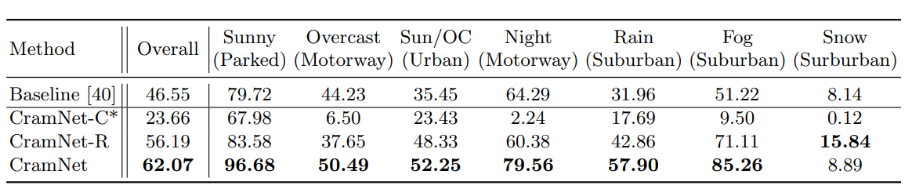
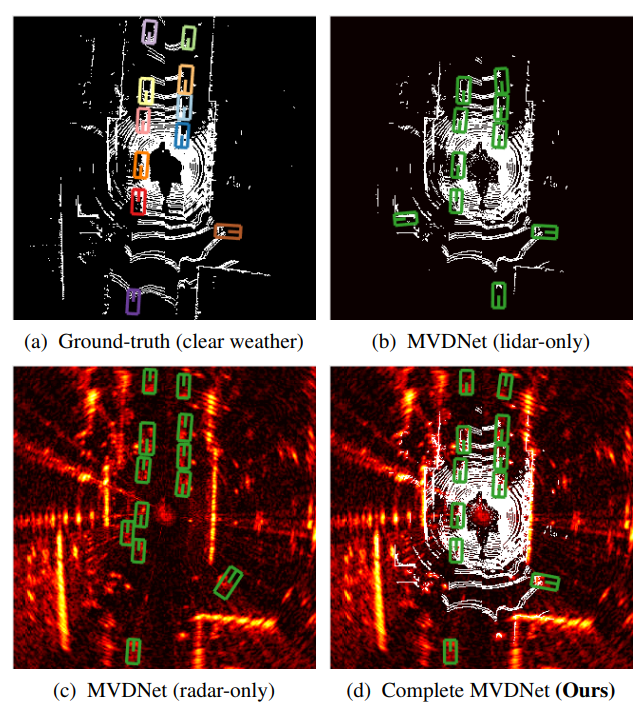
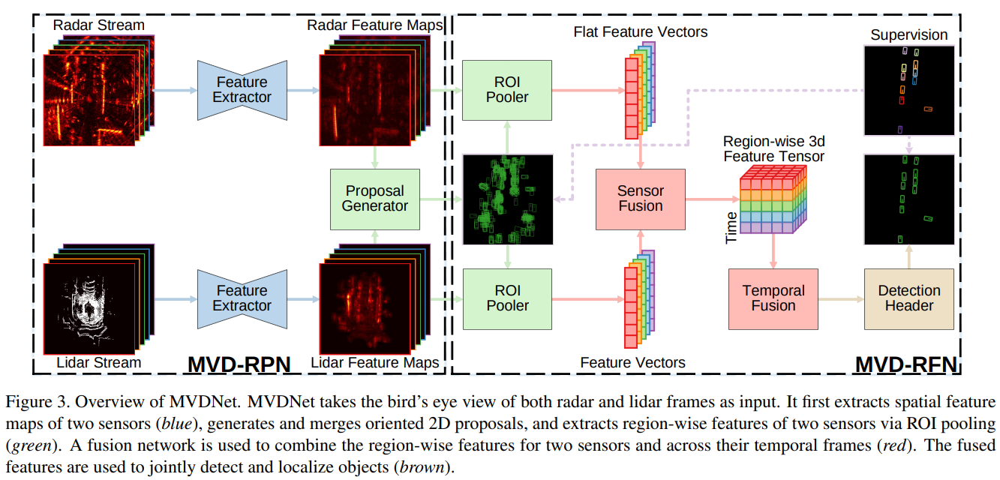

# Radar in Autonomous Perception

Redundancy and/or fusion in the input sensor/perception stack for autonomous driving typically improves safety as it can either 1) compliment each sensor's weakness with another sensor's strength, or 2) validate output from one sensor with output from another such that some robustness if guarentee in the case one of the sensors fail.

The most common multi-sensor setup used in autonomous driving is LiDAR & RGB camera, where the LiDAR provides sparse but accurate depth sensing and the camera provides dense and more semantics-focused information. Recently, Radar is also explored as an alternative sensor to consider, given its cost effectiness and ability to provide (sparser) depth information.

## CramNet: Camera-Radar Fusion with Ray-Constrained Cross-Attention for Robust 3D Object Detection

[[Paper]](https://arxiv.org/abs/2210.09267)

* CramNet follows Range Sparse Network style architecture for efficient 3D feature processing but further contributes with novel radar & image input feature fusion.

* Each branch procsses input via 2D UNet in their corresponding views (perspectiev or BEV), and predicts foreground with depth.

* Predicted foreground pixels and depths are projected to 3D space for feature fusion an final 3D CNN detection head, which is based on the CenterNet detection head.

* Each supervision (foreground, depth, 3D bbox) are either the originally provied 3D bounding box labels or the labels generated by processing them e.g. bboxes projected to image space to get their foreground mask labels as shown in figure.

* Camera depth estimation is further augmented with ray-constrained cross attention. With each estimated pixel depth as initial estimate, the estimated is refiend with a cross attention module that compares camera and radar features. This is built on the assumption/understanding that camera and radar features will match at the corresponding depth.

* Sensor dropout is applied at feature level to simulate adverse weather and adversarial scenarios.

* Evaluation against Radar-only Faster R-CNN baseline shows that CramNet, while the raar only variant working better, shows that combiend with images provides much more improved BEV AP.

* Q: Regarding sensor dropout, shouldn't the model be further augmented to be input-uncertainty aware like SeeingthruFog?

## Simple-BEV

## Robust Multimodal Vehicle Detection in Foggy Weather Using Complementary Lidar and Radar Signals

[[ArXiv]](http://xyzhang.ucsd.edu/papers/Kun.Qian_CVPR21_MVDNet.pdf)

* LiDAR has accurate, metric 3D scene understanding but is suceptible to various weather conditions such as snow and fog. While Radar is more robust to such weather conditions, it is also low resolution, two-dimensional, and has various high intensity peaks near its range bounds.

* Authors propose MVDNet, designed to fuse LiDAR and Radar for its complementary strengths, for robust 3D object detection.

* Radar and LiDAR BEV images (LiDAR depth is stacked) are individually processed by custom CNN (in order to utilize temporal information, handle sensor asynchronization, etc, H timesteps worth of input is fed to the model)
* H timesteps feature maps are fused and proposals are generated
* Using ROI pooling features are pooled for all ROIs (proposals from both modes are unionized to create one large set of proposals), which is then fused sensor-wise (cross attention) and time-wise (3D CNN).

* Data augmentation is used to simulate adversarial sensor weathers, typically snow and fog causes shorter LiDAR visibility and noisy hits in nearby regions. 