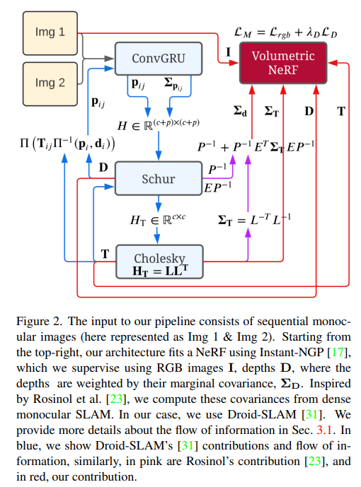
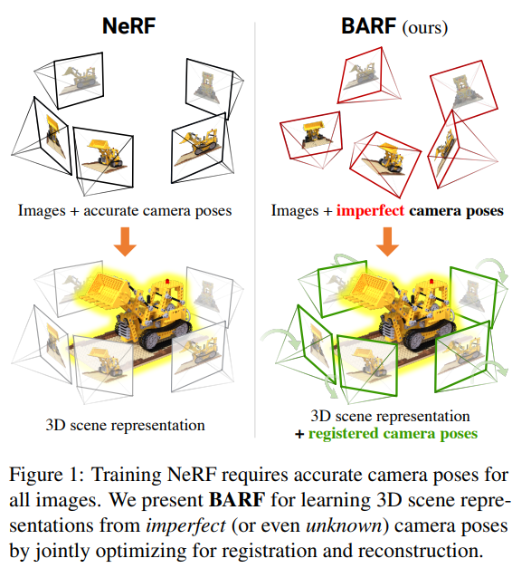
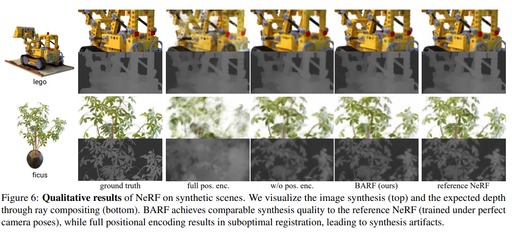
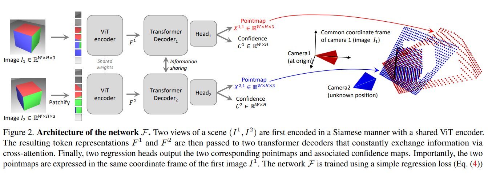
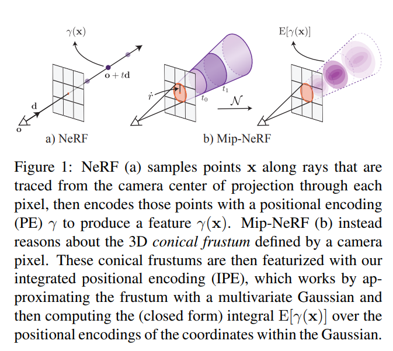

# Semantics and NeRF: Towards 3D Semantic Scene Understanding from images (and Gaussian Splats below..)

This blog covers the line of work in integrating semantic knowledge into NeRF (Neural Rendering Field) for 3D Semantic Scene Understanding. 

*disclaimer: I am not an author for any of the presented work*

## Background: [NeRF](https://www.matthewtancik.com/nerf) (ECCV 2020)
NeRF, or Neural Radiance Fields, gained major attention when it was introduced with the paper [*Representing Scenes as Neural Radiance Fields for View Synthesis*](https://www.matthewtancik.com/nerf) in ECCV 2020. (Perhaps this idea stems much further back but this is the earliest occasion I know that really began to gain attention).

The approach works by training a MLP for each individual 3D scene, where the MLP optimizes for "an underlying continous volumetric scene function". Formally put, the MLP learns function F where

```math
F_{\Theta}(x,y,z, \theta, \phi) = RGB\sigma
```

Hence, the MLP as input takes the 3D xyz location (of the observed point) and the viewing point ($\theta, \phi$) as input, and outputs the corresponding color (RGB) and density($\sigma$) as output.

To train this network, it's important to note that NeRF utilizes **differential rendering** - using points along the camera rays as query points, NeRF is used to collect the RGB and radiance density along each ray to generate a rendering of the scene that is compared to the *actual image* provided by the data. Therefore, the loss is similar to a reconstruction loss where NeRF is optimized to produce renderings that best match the actual observation, and when trained under this objective NeRF may be queries from different view points for neural view synthesis.

## [In-Place Scene Labelling and Understanding with Implicit Scene Representation](https://shuaifengzhi.com/Semantic-NeRF/) (Semantic NeRF; ICCV 2021)

Naturally, when considering NeRF and semantics, one may consider the following question:

>  *Can NeRF be extended to be trained with Semantic labels?* 

And the answer is yes! Zhi et. al. was able to achieve this by extending the NeRF architecture to output semantic distribution $s$ in addition to the original RGB and emission density:

<!--  -->


*Semantic NeRF architecture[1]*

As shown above, given dataset of RGB images with known poses, as well as their **semantic labels**, Semantic NeRF is trained to not only render the RGB viewpoint but also the corresponding segmentation labels. Therefore, the authors now have a 3D reconstruction of the scene with semantics.

Besides 3D semantic scene understanding, Semantic NeRF provides additional features such as denoising (learning 3D scene from multiple views allows model to render denoised semantic mask), super resolution (3D reconstruction learned from coarse/sparse label can transfer to finer resolution at inference), and full 3D scene reconstruction (NeRF has this capability but implicitly).

## [NeSF: Neural Semantic Fields for Generalizable Semantic Segmentation of 3D Scenes (TMLR 2022)](https://nesf3d.github.io/)

Exploring further from the idea initially explored by Semantic NeRF, Vora et. al. explore generalizable 3D semantic scene understanding by decoupling learning 3D geometry (orignial NeRF objective) and semantics (using semantic labels).


*NeSF[2]*

The key idea is to split the *geometric reconsturction* via NeRF and *semantic labeling* via 3D UNet. Upon training NeRF from set of images, the learned density field is then passed to the 3D UNet for segmentation. It's important to note here that then NeSF can be applied to unlabeled scenes, where only the RGB images are needed for NeRF, whereas the 3D UNet trained from other datasets can be used for semantic labeling. This allows generalization to novel scenes where the semantics are provided by pre-trained segmentation network, while 3D reconstruction is conducted by NeRF in self-supervised manner (since NeRF only needs the set of RGB images of the scene for implicit 3D view synthesis and density grid modelling).


*NeSF Training[2]*

The Semantic 3D UNet is also trained via differential rendering and does not require explicit 3D labels, and therefore the framework can learn from sparsely labeled data (i.e. set of RGB images for scenes with labels provided for only some of the images).


## [Panoptic Neural Fields: A semantic Object-Aware Neural Scene Representation](https://abhijitkundu.info/projects/pnf/) (CVPR 2022)

Panoptic Neural Fields developed by Kundu et. al. generalize beyond prior work by developing neural fields for dynamic outdoors scenes with panoptic capabilities, therefore able to detect not only the semantics but individual instances of the scene. Their key improvement is that they can *capture dynamic scenes* as well as *semantic instances*.


*PanopticNeRF[3]*

The key architectural design of their method is to train separate MLPs for stuff (terrain) and for things (objects) independently. While the stuff classes are trained with a foreground and background MLP, each instance of thing classes are trained by a separate MLP. Because each object instance is represented by a separate MLP, the networks can be very small in comparison to developing one very large MLP for the whole scene. Similar to prior, they use volumetric rendering generated by their MLPs to optimize network parameters with the observed RGB images and predicted 2D semantic images.

The learned representation at test time can then be used for various tasks - depth, instance segmentation, semantic segmentation, and RGB by generating rendering from the trained MLPs.

While their limitations may be that they do require a lot of prior information either provided or predicted i.e. camera poses, object tracks, semantic segmentations, they show remarkable results on outdoor scenes that is usually challenging for NeRF.

## [Nerflets: Local Radiance Fields for Efficient Structure-Aware 3D Scene Representation from 2D Supervision](https://jetd1.github.io/nerflets-web/)
[[Project page]](https://jetd1.github.io/nerflets-web/) [[Paper]](https://openaccess.thecvf.com/content/CVPR2023/papers/Zhang_Nerflets_Local_Radiance_Fields_for_Efficient_Structure-Aware_3D_Scene_Representation_CVPR_2023_paper.pdf)


The multiresolution structure
allows the network to disambiguate hash collisions


## CLIP-Fields
[[ArXiv]](https://arxiv.org/pdf/2210.05663.pdf)

Contributions:
* Datset Generation
* Application of NeRF (Instant-NGP) to learn CLIP embeddings + original novel view synthesis objective

Label/Dataset Generation:
* Assume RGBD + odometry available
* Depth images are converted to point clouds and aggregated to get complete view of the scene
* features from RGB + Detic detection model is projected onto the depth cloud for 3D scene reconstruction
* reconstructed scene is used to sample RGBD images with the semantic embedding labels for CLIP Field-training.
* CLIP embedding: 
- image level: embedding of each point is the aggregated embedding of CLIP image/region-embeddings of all images including that point, weighted by the distance.
- region level: use Detic, an open vocab detection model that outputs boudning boxes + embedding. 

Losses:
* semantic contrastive loss: points with the same CLIP/semantic label as positives, rest as negatives
* Instace Segmentation loss: if provided, a separate head is created to train instance segmentation embeddings as an auxilliary training objective.


## VL-Fields

* Uses LSeg, which outputs segmentation mask in CLIP embedding space
* Standard NeRF ray-marching / volume rendering method is considered
The proposed model has:
1. Hash grid encodings for multi-level feature represntation
2. two-layer tiny MLP as output with two heads: one for color, and another for CLIP embedding. Note that the semantic head is feature-invariant

* Comparison against LSeg and CLIP-Fields
* Indoors 2D Segmentation dataset Replica used to run mIoU evaluation on known set of classes by compring rendered novel view semantic masks to the ground truth labels.

## Nerflets

* Main idea: use small NeRF model (MLP) for each local region in scene, instead of a single large MLP model
    * This is in line with work of instant NGP and other hash-grid based methods
* 

## OVNerf
[[ArXiv]](https://arxiv.org/pdf/2402.04648)


## EmerNeRF

## DistillNeRF

# Gaussian Splatting

## 3D Gaussian Splatting

## 4D Gaussian Splatting

# SLAM and Neural Fields

The general paradigm in integrating NeRF to SLAM is to utilize SLAM for pose estimation and tracking, while NeRF is utilize as the mapping module.

## NeRF-SLAM
[[ArXiv]](https://arxiv.org/pdf/2210.13641.pdf)

<p align="center">

</p>

* Integrate real-time monocular SLAM pipeline with real-time NeRF (instant NGP)
* Droid-SLAM as the tracking module that provides camera poses, depth estimate with uncertainty
* instant NGP trained as mapping module using the estimated camera pose, captured RGB keyframes and the depth estimate for rendering loss (RGB, Depth)
* Depth loss scaled by uncertainty of the estimate from tracking module for stability

## Gaussian Splating SLAM

[[Project Page]](https://rmurai.co.uk/projects/GaussianSplattingSLAM/)

## Feature 3DGS
feature 3d-gs notes
* semantic integration of radiance fields e.g. semantic nerf, etc typically learn separate MLPs for RGB and features
* the typically hold different resolution, feature maps often being the smaller of the two
* authors propose method that trains/render them jointly to synergize information sharing between the two.
* Gaussian has centroid, rotation matrix, color, and semantic feature --> both RGB and features are rasterized to the same resolution during supervision
* model features typically has very high dimensionality i.e. 512, 768, etc. and so to speed this up authors developed a speed-up module for faster rasterization process --> 
 authors propose using 1x1 decoder to compress features to smaller latent dimensions - EmerNeRF does this via PCA reduction.
 * Making promptable gaussian field - for each pixel the corresponding gaussians' feature similarity of query and their feature are calculated, with the softmax outputting probabilistic assignment --> gaussians with low probability can be ignored for any interaction.

* SAM is integrated by distilling the encoder features, hence the decoder can be ran on any view to run the model in an interactive manner

## Open-Vocabulary 3D Semantic Segmentation with Foundation Models

https://openaccess.thecvf.com/content/CVPR2024/papers/Jiang_Open-Vocabulary_3D_Semantic_Segmentation_with_Foundation_Models_CVPR_2024_paper.pdf

3d open vocab segmentation with foundation models utilizes recent foundation models such as CLIP, LSEG, but also Large Vision-Language Models such as LLaVA-1.5. Authors first identify from image using LVLM on possible categories, concepts, etc to parse, identifying semantics in the image. These extracted EntityTexts allow labeling much more diverse embeddings than directly and only distilling the output from the image encoder such as CLIP or LSeg. This (name+description) pair is assigned to pixels by generating ROIs, capturing their image embedding e.g. CLIP, Lseg to then match them as the corresponeding entityText.

This is potentially a bit more comprehensive way to capture features from input images, as it uses the entire image to first capture concepts and semantics rather than capturing semantics per crop/whole image.


# Other Related Works

## NeRFtrinsic Four: An End-To-End Trainable NeRF Jointly Optimizing Diverse Intrinsic and Extrinsic Camera Parameters

Oct 2023

[[ArXiv]](https://arxiv.org/pdf/2303.09412) [[Code]](https://github.com/HannahHaensen/nerftrinsic_four/tree/main)

End-to-end optimization of intrisinc and extrinsinc parameters alongside NeRF based dense scene representation learning.

### Intrinsic parameters estimation:

* Following the pinhole camera model, and with fixed number of varying cameras known a priori, a learnable array of length equal to the number of cameras is trained. (proposed method can handle multiple different types of cameras and their images in a combined setting)

### Extrinsic parameters estimation:

* Following the pinhole camera model, transformation matrix [R|t], i.e. rotation and translation components, are trained with an MLP

* MLP with Gaussian Fourier Features are used to learn high-frequency functions, which is an alternative to the sinuisoidal positional encoding used for training NeRFs in prior work

### Learning the parameters

* NeRF is trained with differentiable volume rendering, and authors utilize this to jointly train the intrinsic/extrinsic parameters

* The paramers are used for volume rendering, and the gradient from rendering loss is not only back-propagated through the neural radiance field but also through the parameter arrays for intrinsic K and extrinsic [R|t].

## BARF: Bundle-Adjusting Neural Radiance Fields
[[ArXiv]](https://arxiv.org/pdf/2104.06405) [[Code]](https://github.com/chenhsuanlin/bundle-adjusting-NeRF)

<p align="center">

</p>

* NeRF training typically required known accurate estimate of cameras poses as a pre-requisite, and their accuracy highly depended on the accuracy of poses

* To alleviate this issue, BARF integarates bundle adjusting to jointly optimize for the camera poses, and therefore can either refine the imperfectly estimated poses or train NeRF with images without any pose estimation.

* BARF's principle technically supports both 2D and 3D alignment. 

* Section 3.3, 3.4

<p align="center">

</p>

## DUST3R
[[Code]](https://github.com/naver/dust3r) [[ArXiv]](https://arxiv.org/pdf/2312.14132)

<p align="center">

</p>

> "Our model is trained in a fully-supervised manner using a simple regression loss, leveraging large public datasets for which ground-truth annotations are either synthetically generated, reconstructed from SfM softwares or captured using dedicated sensors."

* Many geometric vision tasks, e.g. SfM, MVS, are approached with individually developed pipelines that 1) do not synergize well between tasks and 2) are also rather brittle on its own and can show compounding errors.

* DUST3R is a supervised model, trained in the stereo-input setting where one input is treated as the origin frame and the other as second frame with unknown pose

* Model is trained to output per-pixel 3D point (xyz), always in the origin frame. This implies that the model learns 3D geometric understanding for any arbitrary pair of input images, and that the output can be used to perform various downstream tasks such as depth estimation, pose estimation, camera registeration, 3D reconstruction, etc.

* DUST3R's pointmap output ie. W * H * 3 (xyz), instantly provides depth, the intrinsics, and the pose between the two frames.

* By training with large supervised datasets, the DUST3R model can handle uncalibrated, unposed pairs of images

* As shown in the figure above, DUST3R's main architecture includes ViT encoder applied identically to each input for feature extraction, which is then fused via transformer decoder and finally predicted point map with the output head. In the decoder, each input tokens serve as query set for the other input tokens and thus the information is shared via the cross attention mechanism.

* As aforementioned, model is trained with supervised learning - L2 regression is applied between each predicted point of the pointmap:

$$\mathcal{L}_{regr}(v, i) = || \frac{1}{z}X_{i}^{v, 1} - \frac{1}{\bar{z}}\bar{X}_{i}^{v, 1} ||$$

For given viewpoint $v$ and pixel $i$. It's to be noted that the model is trained in *normalized coordinates* in order to support various datasets and applications.

* Model is also trained with confidence output and hence with confidence-weighted regression loss

* Model output can be used to perform various downstream tasks including but not limited to point matching, intrinsics estimation, and pose estimation

* DUST3R is not limited to pairwise settings as it can be integrated to multi-camera setting by constructing a pair-wise graph. Pairs are constantly processed through the model to estimate relatives poses and eventually place all the images' corresponding point maps in a single, global frame.

* Although requiring a separate second stage, DUST3R is naturally integrated to handle arbitrary number of images by considering pairs of them to build pairwise image reconstruction. 

* Works such as [InstantSplat: Sparse-view SfM-free Gaussian Splatting in Seconds](https://instantsplat.github.io/) is able to use DUST3R as SfM intiializtion for Gaussian splatting to build neural rendering models rapidly (examples all optimize within 40 seconds).

## InstantSplat: Sparse-view SfM-free Gaussian Splatting in Seconds
* Works such as [InstantSplat: Sparse-view SfM-free Gaussian Splatting in Seconds](https://instantsplat.github.io/) is able to use DUST3R as SfM intiializtion for Gaussian splatting to build neural rendering models rapidly (examples all optimize within 40 seconds).

## Mip-NeRF: A Multiscale Representation for Anti-Aliasing Neural Radiance Fields
[[ArXiv]](https://arxiv.org/abs/2103.13415)[[Code]](https://github.com/google/mipnerf)

<p align="center">

</p>

* NeRF works well, but it is typically trained and tested on the same resolution
* When rendering pixels of far regions/objects, base ray casting integrates over single coordinates over what would be representing large spaces, leading to aliasing error.
* Mip-NeRF takes inspiration from mipmapping to represent each ray as instead a gaussian frustum - the much more geomtry aware positional encodings feature is fed into MLP as input for the final pixel render output.
* Coarse-and-fine MLP design: "Mildenhall et al. construct t
c by sampling 64 evenlyspaced random t values with stratified sampling. The compositing weights wk = Tk (1 − exp(−τk(tk+1 − tk))) produced by the “coarse” model are then taken as a piecewise
constant PDF describing the distribution of visible scene
content, and 128 new t values are drawn from that PDF using inverse transform sampling to produce t
f
. The union of
these 192 t values are then sorted and passed to the “fine”
MLP to produce a final predicted pixel color."

* The updated sampling therefore respects the scale of geoemtry dependent on the range via cone tracing and integrating positional encoding.
* The most effective way to estimate the integrated positional encoding would simply be to calculate the expected positional encodign of all coordinates that lie in this frustum. However, this would be expensive to compute and hence is estimated by definiting multivariate gaussians taht approxiate the frustum with mean distance along the ray, variance along teh ray, and variance perpendicular to the ray.


## Mip-NeRF 360: Unbounded Anti-Aliased Neural Radiance Fields

* Extending Mip-NERF to unbounded scenes, which both Mip-NeRF and prior NeRF methods often struggle since the scene content may exist at any, potentially extremely far distances.
* Prior coarse-to-fine approach is resource wasteful as the coarse rendering does not actually contribute to the final output, while the are separately trained and the process is two-stage. As a solution authors suggest having "proposal MLP" and a "NeRF MLP."
    * Proposal MLP predicts only densities 
    * The densities are used to resample new intervals for NeRF MLP to actually acquire the rendering

## Scene Representation Transformer: Geometry-Free Novel View Synthesis Through Set-Latent Scene Representations
[[ArXiv]](https://arxiv.org/abs/2111.13152)


### (O)SRT's volumetric Parmetrization

## Object Scene Representation Transformer
[[ArXiv]](https://arxiv.org/abs/2206.06922)


Object Scene Representation Transformer, or OSRT, focuses on the task of efficient Novel View Synthesis (NVS), but with the additional consideration of object decomposition that puts it a step away from the prior work Scene Representation Transformer (SRT).

OSRT thus learns an implicit scene representation model of the surrounding 3D scene gievn input RGB images, with or without pose estimation.

This is made possible by learning the rendered algorithm with attention based decoder as well, instead of volume rendering that is typically used for Neural Radiance Fields.

In terms of architecture, OSRT learns a transformer encoder that learns to generate set of latent code set to encode input scene, while the slot mixer learns to aggregate the information to decode output rendering for novel scenes. The slot attention and mixer in particular allows object-aware scene decomposition with the aerned 3D representation, while using attention only during slot mixing and not with the decoder allows the model to have stronge decomposition knowledge.

Results on easy-to-hard challenges on datsets generated using CLEVER3D and Multi-Shapenet, where difficuly increases from simple background with simple shaped solids to more diverse backgrounds and objects, as well as novel objects, OSRT in particular significantly outperforms prior work including ORT, while showing strong object-awareness with decomposition. Because it uses the slot attention to render and not volume rendering, it also runs real time. This further adds to the benefit taht OSRT learns to develop representaion for given set of input images rather than learning a single NN for each scene like that of NeRFs.


In teh case of OSRT, Novel View Synthesis is crucial auxilliary task for the model to learn, as otherwise there's no supervision to force the model to learn the underlying 3D represntation instead of memorizijng features in a reconstufction-style learning.

Developing a general feature extraction model for downstream perception taks by developing an understanding of objects and geometry and naturally emergine behavior for novel view synthesis.


## NeRFAcc
The mathematical formulation for **transmittance as the key element for importance sampling** in Neural Radiance Fields (NeRFs) is based on the relationship between **transmittance** and the **probability density function (PDF)** for volumetric rendering. Here's a breakdown of the key formulation from the paper:

### 1. **Volumetric Rendering**:
In volumetric rendering, the goal is to compute the color of a pixel \( C(r) \) by integrating the contribution of samples along the ray \( r \), which is a weighted combination of the radiance emitted at different points along the ray:
\[
C(r) = \int_{t_n}^{t_f} T(t) \sigma(t) c(t) \, dt
\]
where:
- \( T(t) \) is the **transmittance** along the ray, representing the probability that the ray travels unoccluded up to time \( t \).
- \( \sigma(t) \) is the **density** at a given point along the ray.
- \( c(t) \) is the **color** emitted at that point.

The transmittance \( T(t) \) at time \( t \) is given by the exponential decay of accumulated density along the ray:
\[
T(t) = \exp\left(-\int_{t_n}^{t} \sigma(s) \, ds \right)
\]
This transmittance represents the fraction of light that reaches the point without being blocked.

### 2. **Importance Sampling**:
The key to efficient sampling in volumetric rendering is to distribute samples based on a **PDF** that favors regions contributing more to the final image. The PDF is derived from the transmittance \( T(t) \) and the density \( \sigma(t) \):
\[
p(t) = T(t) \sigma(t)
\]
This formulation expresses that the probability of sampling a point \( t \) depends on both the transmittance up to that point and the density at that point.

### 3. **Cumulative Distribution Function (CDF)**:
To generate samples according to the PDF \( p(t) \), we compute the **cumulative distribution function (CDF)** \( F(t) \), which gives the cumulative probability up to time \( t \):
\[
F(t) = \int_{t_n}^{t} p(v) \, dv = 1 - T(t)
\]
Thus, the CDF is simply related to the transmittance \( T(t) \).

### 4. **Inverse Transform Sampling**:
To generate samples according to the PDF, the paper uses **inverse transform sampling**. Given a random uniform sample \( u \in [0, 1] \), the corresponding sample \( t \) can be computed by inverting the CDF:
\[
t = F^{-1}(u)
\]
Since \( F(t) = 1 - T(t) \), inverse transform sampling relies on computing the transmittance \( T(t) \) efficiently.

### 5. **Unified View of Sampling**:
The paper shows that **transmittance** is all you need for importance sampling because it governs the PDF and CDF used to generate samples:
\[
F(t) = 1 - T(t)
\]
This insight unifies different sampling techniques (e.g., coarse-to-fine, occupancy grid) under the same framework, where each method constructs an estimator for transmittance and uses it to perform importance sampling along the ray.

### Conclusion:
The key mathematical takeaway is that **transmittance \( T(t) \)** is sufficient to determine the optimal samples for rendering since it governs both the probability distribution \( p(t) \) and the cumulative distribution \( F(t) \) along the ray. Efficient sampling strategies focus on estimating transmittance to concentrate samples in regions where the radiance changes significantly (e.g., near surfaces).

This formulation is used by the NerfAcc toolbox to accelerate NeRF training by applying different transmittance estimators to improve sampling efficiency.

### References
[1] Zhi, Shuaifeng, et al. "In-place scene labelling and understanding with implicit scene representation." Proceedings of the IEEE/CVF International Conference on Computer Vision. 2021.

[2] Suhani Vora, Noha Radwan, Klaus Greff, Henning Meyer, Kyle Genova, Mehdi S. M. Sajjadi, Etienne Pot, Andrea Tagliasacchi, & Daniel Duckworth (2022). NeSF: Neural Semantic Fields for Generalizable Semantic Segmentation of 3D Scenes. Transactions on Machine Learning Research.

[3] Kundu, A., Genova, K., Yin, X., Fathi, A., Pantofaru, C., Guibas, L., Tagliasacchi, A., Dellaert, F., & Funkhouser, T. (2022). Panoptic Neural Fields: A Semantic Object-Aware Neural Scene Representation. In Proceedings of the IEEE/CVF Conference on Computer Vision and Pattern Recognition (CVPR) (pp. 12871-12881).