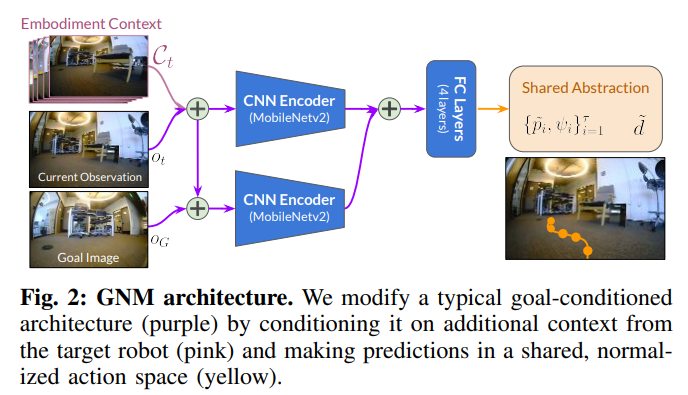

# Toward Foundational Models in Visual Navigation

## [GNM: A General Navigation Model to Drive Any Robot](https://arxiv.org/abs/2210.03370)

GNM, ViNT, and NoMaD explore the general visual navigation paradigm, where the goal is to develop a foundation model for an ubiquitous navigation policy across different robotic platforms.

* GNM processes observation history and goal image as input, and outputs normalized action space (0,1) that can later be adapated to any robot-specific controller

* Image input processed by CNN, final action generated via MLP as the policy network 

* The collection of past observed frames help provide the embodiment context needed for the model to quickly figure out the robot's capabilities and its characteristics

* Global planning is achieved by construting a topological map that uses the estimated temporal distance between frames as measure of connectivity (edge). With dijkista the set of nodes as trajectory is determined, and each node(image) is then used as goal during inference

* Trained with a collection of publicly available datasets, including but not limited to data collected on the warthog, spot, jackal, ATC, etc.

## [ViNT: A Foundation Model for Visual Navigation](https://arxiv.org/abs/2306.14846)
*Venue: arXiv* 
*Authors: Dhruv Shah†, Ajay Sridhar†, Nitish Dashora†,
Kyle Stachowicz, Kevin Black, Noriaki Hirose, Sergey Levine*  

* Improvement on GNM by using a transformer model as the main architecture, which replaces the MLP from prior work

* With the transformer architecture, ViNT scales much better with data

* The input image encoder is also improved from MobileNetV2 to Efficientb0.

* Because ViNT uses tokens as its main representation, the goal encoder could be replaced with anything e.g. map based encoder, to allow heterogenous goal processing

* ViNT further achieves exploration behavior by using a diffusion model to generate fake goal images.

## [NoMaD: Goal Masking Diffusion Policies for Navigation and Exploration](https://arxiv.org/abs/2310.07896)

* Augments prior method with two novel contriubtions: 1) Goal Masking to allow for both goal-conditioned navigation and exploration(new), and 2) Diffusion policy to generate normalized action

* Diffusion policy allows for more robust navigation than before e.g. collision avoidance, although not perfect, while also multimodal.

* Goal masking allows model to explore with a goal, which can help build topological map and provides more flexibility. In comparison to prior work's use of generated images, goal masking provided a much more natural method to achieved undirected exploration.