# Using Attention in Computer Vision

This blog surveys set of DNN architectures in Computer Vision that uses attention.

## (ViT) An Image is Worth 16x16 Words: Transformers for Image Recognition at Scale
[[ArXiv]](https://arxiv.org/abs/2010.11929)

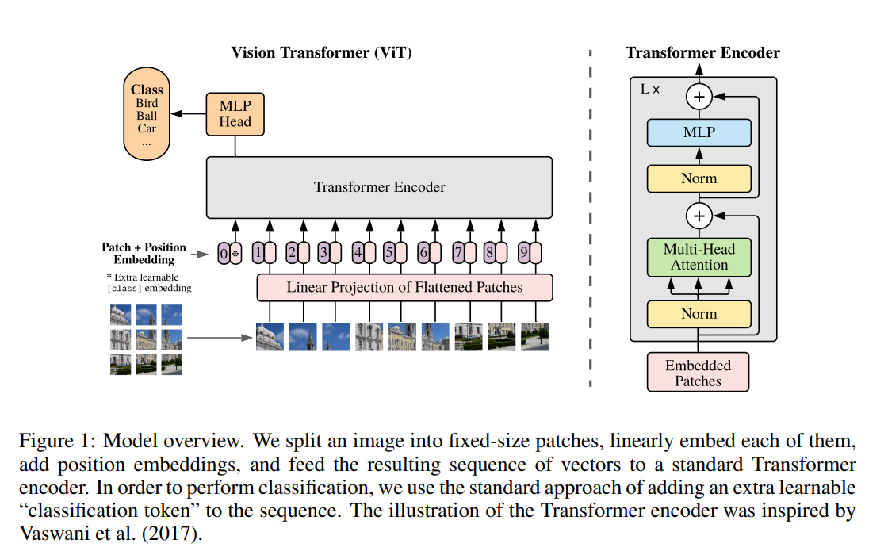

* First(?) application of attention for CV
* 16x16 image patches processed as tokens with linear projection from 16x16-->D embedding.
* Set of tokens fed to transformer architecture (self-attention based i.e. BERT) and the [CLS] token used as classifier for image recognition
* Position embedding provided since transformer has no spatial information of the token positions in image
* Experiments show that while the attention mapping in ViT learns similar filters to what a CNN might learn, because ViT uses attention and therefore is not bound to the same inductives biases as CNN, the reasoning it learns is much more data-driven and general and therefore may to better performing for that reason.
* Downside is that global attention is O(n^2) and therefore very memory intensive, meaning image patches e.g. 16x16 has to be used and potentially further scaled up for larger images

## Swin Transformer: Hierarchical Vision Transformer using Shifted Windows
[[ArXiv]](https://arxiv.org/pdf/2103.14030.pdf)

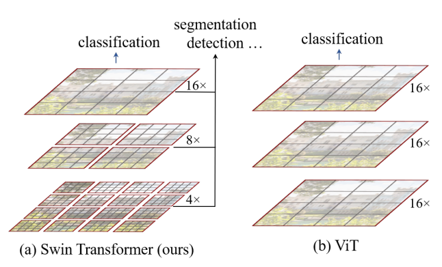

* Swin Transformer focuses on building transformer based hierarchical vision encoder with <i>shifting windows</i>, making it better suited for general downstream tasks such as object detection and semantic segmentation

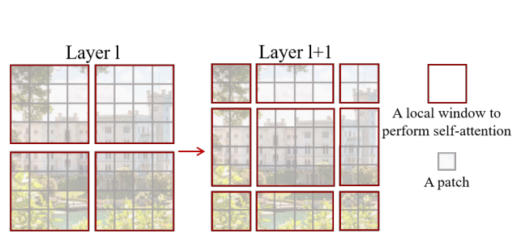

* Pixels from input image are grouped into smaller patches (e.g. 4x4)
* Patches are procssed by local window attention which applies self-attention only within the local winidows for an efficient feature extraction
* After each block the patch merging layer groups neighboring tokens, generating hierarhical representation (this step is conceptually the same as pooling layers for CNN)

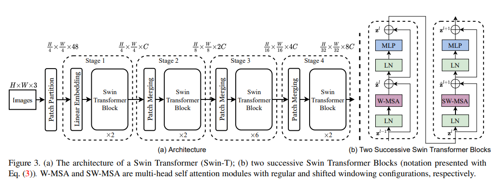

* Since local attention and patch merging alone do not form global attention and effective cross-patch information flow, each Swin Block has shifting windows that re-generates local windows to form information flow across patches

## (PVT, PVTv2) Pyramid Vision Transformer: A Versatile Backbone for Dense Prediction without Convolutions
[[PVTv1 ArXiv]](https://arxiv.org/abs/2102.12122) [[PVTv2 ArXiv]](https://arxiv.org/abs/2106.13797)

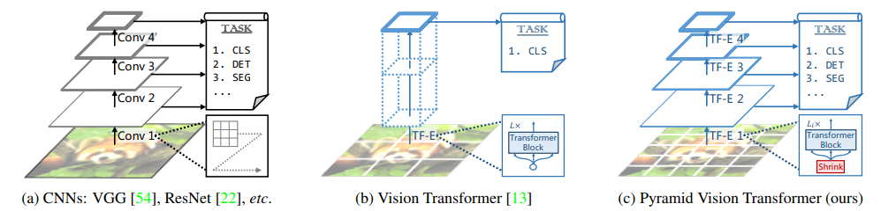

* Extends ViT by developing a pyramid structure that benefits from developing a hierarchical representation similar to prior CNN architectures
* Authors combine PVT with DETR to develop a complete attention-only architecture for object detection

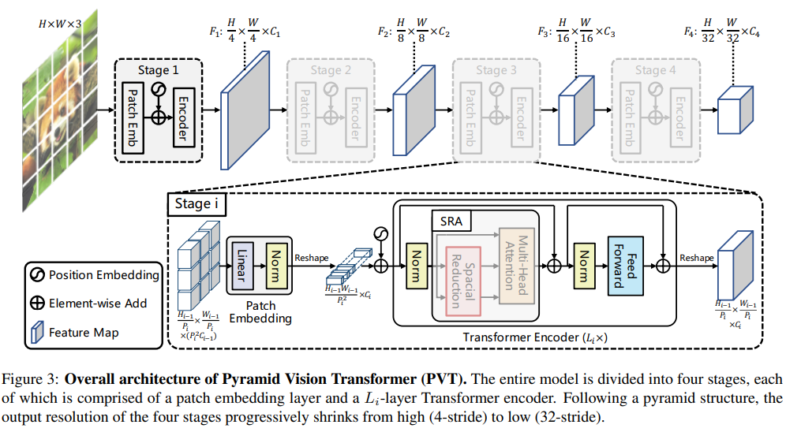

* At the start of each block, the input feature map is grouped into patches and linearly projected as token embeddings, which are then passed to the transformer block. We may view this as running the initl embedding process of ViT for each transformer block. This embedding layer therefore serves as a pooling layer for PVT.
* PVT also uses spatial-reduction attention (SRA) that replaces the original multi-head attention (MHA) that performs more efficient attention by compressing K,V by factor R^2. (i.e.d 1D convolution)

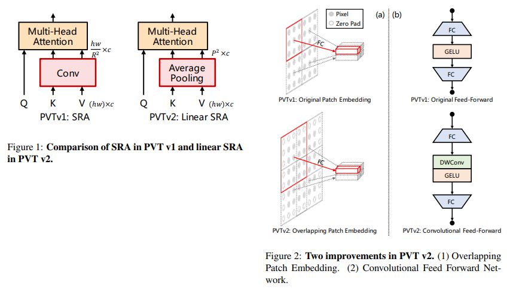

* PVTv2 is an incremental improvement from PVT. In SRA it uses average pooling to compress the sequence instead of using 1D convolution. 

* It also has a modified embedding layer that looks at a region larger than the logal window to get overlapping embdding for cross-window information flow.

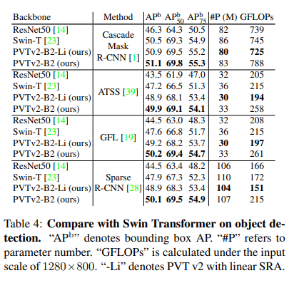

* PVTv2 seems to show better performance on object detection but Swin transformer still shows comparable performance. In future research it probably makes sense to try either (or in the case of domain-specific vision such as LiDAR 3D perception use SWFormer)

## Image GPT

[[Blog]](https://openai.com/research/image-gpt)

* Application of GPT on vision images by OpenAI
* treat each pixel as input token flattened to 1D, predict next pixel autoregressively
* Model able to generate relatively convincing images with masked regions 
* Since each pixel is handled as token, this is quite computationally intensive and difficult to scale to large images
* Showed that self-supervised leraning with transformers via next-token prediction also works for the vision domain, and that features learned from this process also works well a good prior for downstream tasks such as classification.

## SWFormer: Sparse Window Transformer for 3D Object Detection in Point Clouds
[[ArXiv]](https://arxiv.org/abs/2210.07372)

* Extended Swin Transformer architecture to better handle LiDAR input for 3D perception

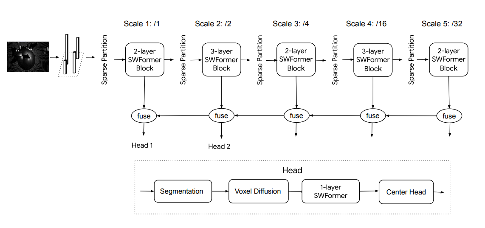

* <b>BEV image</b>: Similar to point pillars, input LiDAR points are bucketed to a sparse BEV grid with fixed range (xy grid, infinite height pillars as voxels). Because the input its sparse, this also means when grouping them into local windows like Swin Transformer, the <i> sparse windows </i> have variable sequence length.
* For effcient batch processing, the sparse window sequence is binned to fixed length B_{k} with all empty voxels in window represented by a single voxel.

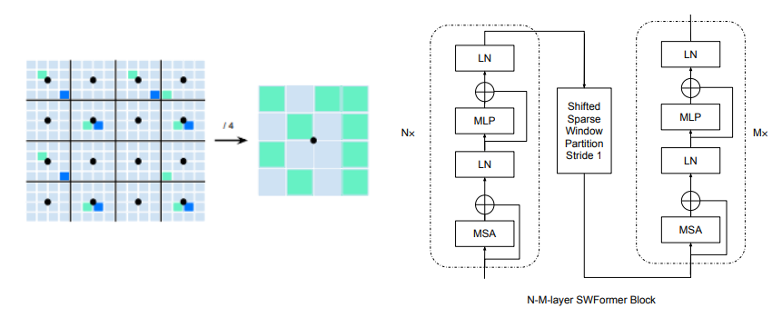

<i>(left)Strided Sparse Window Partition (right)SWFormer block</i>

* <i>Note that the architecture does not involve pooling as it is not sparse tensor friendly (gather operation is expensive).</i>
* <b>Sparse shifting windows</b>: Although shifting windows is an effective method to improve effective receptive field and encourage cross-window information flow, "this shifting operation is expensive in the sparse world as it needs to re-order all the sparse features with gather operations." Hence authors reduce the shifting operation to only once at each stage of SWFormer followed by multiple transformer layers.
* The window size is fixed (10x10) but different strides {1,2,4,16,32} are used to capture windows with increasingly large receptive field. This is achieved with <i>strided sparse window partition</i>

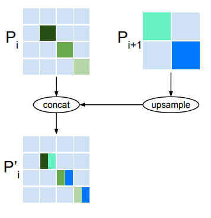

* <b>Multi-scale Feature Fusion</b> fuses the hierarhicical features to generate mutli-scale feature for downstream task head. Output from deeper layer is upsampled and concatenated to the previous block's output following a single SWFormer block. Naive duplication in upsampling does result in dilation of features, and so to prevent this the authors only allow duplication during upsampling in non-empty regions.

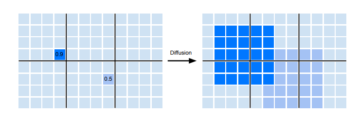

* <b>Voxel Diffusion:</b> Finally, because sparse features often have LiDAR hits on the edge of objects e.g. car instead of the center, detecting objects can become challenging to place anchors. To alleviate this the final feature map after fusion is dilated with k x k max pooling to geenrate a denser feature map for the downstream task. This is only applied to <b>foreground voxels</b> by training foreground segmentation model from supervised data during training e.g. object detection.

* Authors test the model with modified CenterNet, showing new SOTA resutls on the Waymo Open Dataset object detection task.

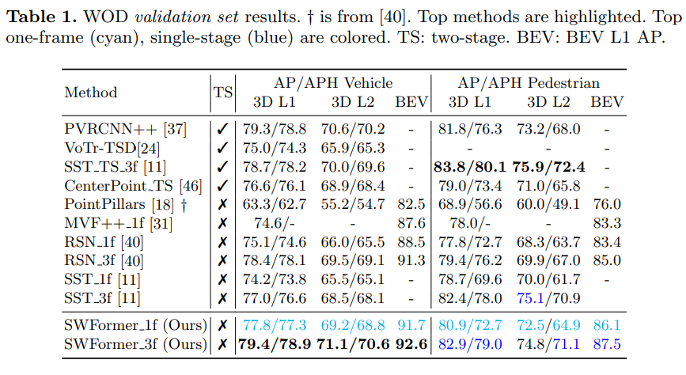

